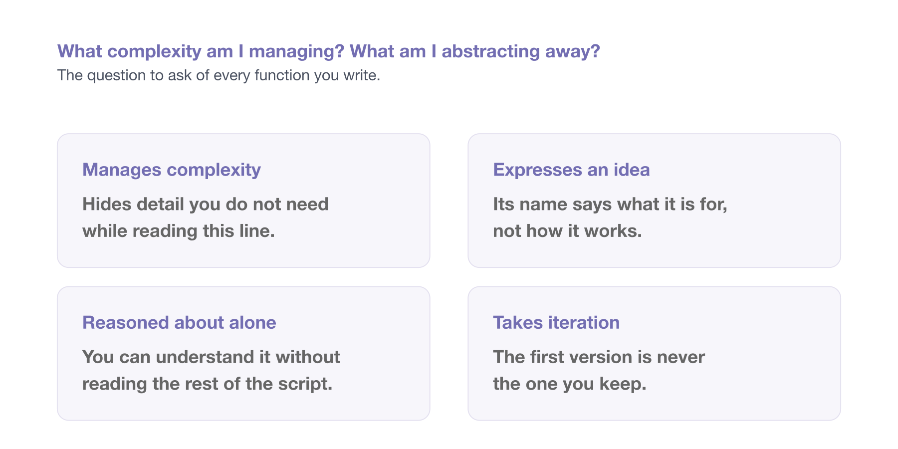
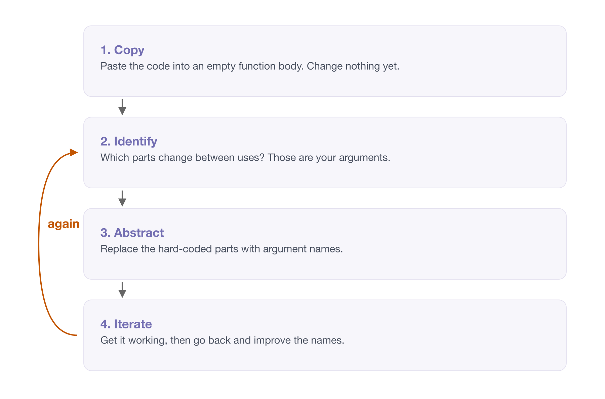

# Designing functions {#sec-designing-functions}

> "I want to get to a level where it works, and I can reason about it."
>
> -- Joe Cheng

Chapter 4 was about what a function is and how to look inside one. This is the next question: given a piece of code, how do you decide what the function around it should be?

It is not part of the six hour course, and you do not need it to get value from everything else. It is here because it is the material I would teach next, and because the hundred line script we have been carrying since chapter 3 deserves to be finished.

::: {.overview}

## Overview {.unnumbered}

**Duration** 50 minutes

**Questions**

- What complexity is this function managing?
- How do I turn a chunk of code into a function, one step at a time?
- What does it look like to take a whole script apart?
- When is a function worth writing, if the code was never repeated?

:::


## Good (simple) function design

Functions are **tools for managing complexity**. That is also called *abstraction*, or *abstracting away*.

So the question when writing one is always: **what complexity am I managing? What am I abstracting away?**

{fig-alt="A question across the top, what complexity am I managing and what am I abstracting away, described as the question to ask of every function you write. Below it, four cards. Manages complexity: hides detail you do not need while reading this line. Expresses an idea: its name says what it is for, not how it works. Reasoned about alone: you can understand it without reading the rest of the script. Takes iteration: the first version is never the one you keep." width=100%}

Here is a real piece of analysis code. It asks whether temperature differs on days when ozone is missing, compared with days when it is not:

```r
is_different <- airquality$Temp
when_missing_index <- which(is.na(airquality$Ozone))
when_complete_index <- which(!is.na(airquality$Ozone))
is_different_miss <- is_different[when_missing_index]
is_different_complete <- is_different[when_complete_index]
result_ozone_temp <- t.test(is_different_miss, is_different_complete)
```

That works. But you can't use it on another pair of variables without editing it, and you can't tell at a glance what it's *for*.

**Writing a function is writing.** You don't get it right on the first pass, and you're not supposed to.

Here's the actual process.

**Start with the bones.** Make an empty function and paste the code into the body.

```r
misstest <- function(Temp, Ozone) {
  # paste the text into the body
}
```

**Ask what you are interested in.** Which parts change? Here it is the variable we are testing, and the variable whose missingness we are splitting on.

**Work out what to name things.** Replace the hard-coded `airquality$Temp` with an argument. Comment out the old line rather than deleting it, so you can see what you are replacing:

```r
misstest <- function(is_different, when_missing) {
  # is_different <- airquality$Temp
  when_missing_index <- which(is.na(when_missing))
  when_complete_index <- which(!is.na(when_missing))
  is_different_miss <- is_different[when_missing_index]
  is_different_complete <- is_different[when_complete_index]
  result_ozone_temp <- t.test(is_different_miss, is_different_complete)
}
```

Naming is tricky, and it's fine for it to take a few goes.

**Return the last thing.** The function currently assigns to `result_ozone_temp` and returns it invisibly. Put it on its own line at the end so the return is explicit to a reader:

```r
  result_ozone_temp <- t.test(is_different_miss, is_different_complete)
  result_ozone_temp
}
```

**Clean up the old lettuce.** Remove the commented-out lines now that you no longer need them.

**Name the function so it evokes the action.** `misstest` was a placeholder. What does this actually do?

```r
missingness_impact <- function(is_different, when_missing) {
  when_missing_index <- which(is.na(when_missing))
  when_complete_index <- which(!is.na(when_missing))
  is_different_miss <- is_different[when_missing_index]
  is_different_complete <- is_different[when_complete_index]
  t.test(is_different_miss, is_different_complete)
}
```

**Then use it**, and write the output to a variable:

```r
temp_difference_ozone_missing <- missingness_impact(
  when_missing = airquality$Ozone,
  is_different = airquality$Temp
)
```

The process, in short:

1. **Copy** the text into the body.
2. **Identify** the complexity to manage.
3. **Abstract** that complexity.
4. **Iterate** - writing functions is iterative, just like regular writing.

{fig-alt="Four steps stacked in a column, joined by arrows. Copy: paste the code into an empty function body and change nothing. Identify: work out which parts change between uses, because those are the arguments. Abstract: replace the hard-coded parts with argument names. Iterate: get it working first, then improve the names. A curved arrow labelled again runs from Iterate back up to Identify, because the middle two steps repeat." width=100%}

::: {.callout-tip title="DRY, and the better version of it"}

You will often be told **DRY**: *Don't Repeat Yourself*. If you copy and paste the same code three times, write a function.

That's true, but it treats the symptom. The real problem is **complex code**.

You only end up repeating yourself because you couldn't *express* the idea. So the cause is expression and reasoning, not repetition.

The version I prefer is **DRRY**: *Don't Re-Read Yourself*.^[Naming credit to [Miles McBain](https://milesmcbain.xyz/).]

The trigger is not "have I typed this three times". It is "have I had to read this block again to work out what it does, and what is different about it this time". That happens on the *first* copy, not the third, and it happens plenty of times when there is no copy at all.

A function isn't only needed when you repeat code. It's needed when you have an idea worth naming.

:::

::: {.callout-note title="Your Turn"}

Earlier you wrote down a sentence describing a chunk of your own code. Now build the function around it, using the process above.

If you don't have one to hand, use one of these. Both do the same thing more than once, with something small changed each time.

**One**

```r
adelie <- penguins[penguins$species == "Adelie", ]
adelie_mean <- mean(adelie$body_mass, na.rm = TRUE)

gentoo <- penguins[penguins$species == "Gentoo", ]
gentoo_mean <- mean(gentoo$body_mass, na.rm = TRUE)

chinstrap <- penguins[penguins$species == "Chinstrap", ]
chinstrap_mean <- mean(chinstrap$body_mass, na.rm = TRUE)
```

**Two**

```r
ozone_high <- airquality$Ozone > 30
ozone_pct <- round(sum(ozone_high, na.rm = TRUE) / sum(!is.na(ozone_high)) * 100, 1)

temp_high <- airquality$Temp > 80
temp_pct <- round(sum(temp_high, na.rm = TRUE) / sum(!is.na(temp_high)) * 100, 1)
```

The second one has two things changing rather than one, so it needs two arguments. Work out which they are before you start typing.

1. **Copy.** Make an empty function, and paste the chunk into the body. Don't change anything yet.
2. **Identify.** Which parts of it change between uses? Those are your arguments.
3. **Abstract.** Replace the hard-coded parts with argument names. Comment the old lines out rather than deleting them, so you can see what you are replacing.
4. **Iterate.** Get it working first, then go back and improve the names. The first name you pick is rarely the one you keep.

Then call your function, and check you get the same answer you got before you started. That check matters. It is very easy to tidy something into a different result.

If you don't have a chunk of your own to hand, use `06-bad-style/messy-analysis.R` from the course repository. The loop at the bottom is doing the same thing to each species, one at a time.

:::

## Revisiting a script {#sec-ozed-refactor}

Everything so far has been one function at a time. Let's do a whole script, because that is what you will actually be handed.

This is the hundred line script from [What is each chunk for?](writing-readable-code.qmd#sec-de-chunking). We left it with six comments in it:

```r
# 1. read the raw spreadsheet for one year
# 2. fix the column names Excel gave us
# 3. pull out the education rows, make them long, drop the wide age bands
# 4. pull out the population rows, make them long, drop the wide age bands
# 5. join them, and work out the proportion studying
# 6. plot it
```

That list is a to-do list. Each line is a function waiting to be given a name, and we already know steps 3 and 4 are the same idea twice.

So let's work down it.

### One chunk at a time

Step 1 was this:

```r
raw_data <- read_excel(
  path = "data/Education and work, 2023, Datacube 2 (Table 11).xlsx",
  sheet = "2014",
  skip = 4,
  n_max = 32,
  .name_repair = make_clean_names
)
```

Same process as before. Copy it into a function body, ask what changes between uses, and make that an argument.

The only thing that changes between uses is the year. It is a sheet in the same workbook.

```r
read_raw_education_data <- function(path, year) {
  read_excel(
    path = path,
    sheet = year,
    skip = 4,
    n_max = 32,
    .name_repair = make_clean_names
  )
}
```

The year changes between calls, so it is an argument. The path changes too - not today, but the day the ABS publishes the 2024 datacube, or the day you point this at a different spreadsheet entirely. A function that reads a file should be told which file.

The script gets one line shorter, and one problem smaller:

```r
raw_data_2014 <- read_raw_education_data(
  path = here("data/Education and work, 2023, Datacube 2 (Table 11).xlsx"),
  year = "2014"
)
```

Notice what just happened to the request that started all this. "Can you add another year?" is now `read_raw_education_data(year = "2015")`. We are not finished, but the hard-coded `2014` has stopped being a fact buried in line 12 and started being an argument.

`here()` snuck in there too, from [Project organisation -@sec-project-organisation]. Building the path with `here()` means the call works the same whether R is sitting in the project root or somewhere else entirely.

### The step that was written twice

Steps 3 and 4 were forty lines between them, doing one idea to two different sets of rows. Here they are side by side, with the pivot and filter trimmed out so the shape is visible:

```r
# step 3: the education rows
data_subset <- data |>
  slice(4:11) |>
  set_names(the_names2)

data_studying <- data_subset |>
  pivot_longer(...,  values_to = "n_studying") |>
  arrange(state_territory, age_group) |>
  filter(...)

# step 4: the population rows
data_population <- data |>
  slice(24:31) |>
  set_names(the_names2)

data_population <- data_population |>
  pivot_longer(..., values_to = "population") |>
  arrange(state_territory, age_group) |>
  filter(...)
```

Same `slice()`, same `set_names()`, same `pivot_longer()`, same `arrange()`, same five-line `filter()`. Two things differ: which rows get sliced, and what the value column is called.

Pull out the shared shape first:

```r
extract_rows_set_names <- function(raw_data, row_numbers, names) {
  raw_data |>
    slice(row_numbers) |>
    set_names(names)
}
```

And now both callers are one line each:

```r
educated_raw <- extract_rows_set_names(
  raw_data_2014,
  row_numbers = 4:11,
  names = new_names
)

population_raw <- extract_rows_set_names(
  raw_data_2014,
  row_numbers = 24:31,
  names = new_names
)
```

Those two lines are worth staring at, because they say something the original script could not. The education rows and the population rows are *the same kind of thing*, pulled from different parts of one spreadsheet. Forty lines of near-identical pipeline never said that. Two calls to one function say it immediately.

### Grouping the small functions into bigger ones

Once each chunk has a name, the chunks themselves start to group:

```r
prepare_education <- function(raw_data) {
  new_names <- extract_education_col_names(raw_data)

  educated_raw <- extract_rows_set_names(
    raw_data,
    row_numbers = 4:11,
    names = new_names
  )

  pivot_longer_educated(educated_raw)
}
```

Three small functions inside one slightly bigger one, and the bigger one reads like the comment it came from: get the names, pull out the rows, make it long.

Do the same for population and for the join, and the whole hundred lines collapse into one:

```r
read_educated_population <- function(year = "2014") {
  raw_data <- read_raw_education_data(year = year)

  educated <- prepare_education(raw_data)

  population <- prepare_population(raw_data)

  combine_educated_population(
    education = educated,
    population = population,
    year = year
  )
}
```

Read that function. It is the six comments, in order, as code.

### What the script looks like now

```r
source("packages.R")
lapply(list.files("./R", full.names = TRUE), source)

educated_population_2014 <- read_educated_population(year = "2014")

ggplot(educated_population_2014, aes(x = prop_studying, y = state_territory)) +
  geom_col() +
  facet_wrap(~age_group)
```

Ninety lines to six. The other eighty-four did not disappear, they moved into `R/`, one file per function, exactly the layout from [Project organisation -@sec-project-organisation].

And here is the bit I find genuinely satisfying. The original request was one more year of data. Now it is one more call:

```r
educated_population_2015 <- read_educated_population(year = "2015")
```

In the hundred line version, that was eighty lines copied and pasted, with five numbers to edit inside them and no way to be sure you got them all.

::: {.callout-tip title="Extension: all ten years at once" collapse="true"}

Not required, and we may not get to this in the session. But it is where the whole chapter has been heading.

Once adding *one* year is one call, adding *ten* is `map()`, which we met back in [Anatomy of a function](#anatomy-of-a-function):

```r
library(purrr)

study_years <- as.character(2014:2023)

educated_population <- study_years |>
  map(\(year) read_educated_population(year = year)) |>
  list_rbind()
```

Ten years, three lines. `map()` gives you a list with one data frame per year, and `list_rbind()` stacks them into one.

The thing to notice is that none of this was available before. You cannot `map()` over the original script, because there is no function to map. Every bit of work above is what bought you these three lines.

You may meet `map_dfr()` in older code, which did the mapping and the stacking in one call. purrr superseded it in version 1.0.0, in favour of the two steps above.

:::

::: {.callout-tip title="Read the whole thing"}

The full progression lives in the [ozed repo](https://github.com/njtierney/ozed), one script per step: `script_00.R` is the starting point, and `script_03.R` is the ten year version. Every intermediate step is there too, so you can see it happen a chunk at a time rather than as a before and after.

It is not finished, and I have left it that way on purpose. `pivot_longer_educated()` and `pivot_longer_population()` are still nearly the same function, differing in one argument. That is the next thing I would fix, and you can see exactly why by putting them side by side.

:::

::: {.callout-note title="Your Turn"}

1. Take the script you chunked in the last chapter. Turn the *first* chunk into a function. Only the first. That is the `read_excel()` call at the top, the one commented `# 1. read the raw spreadsheet for one year` - the same chunk we turned into `read_raw_education_data()` above.
2. Run the script again. Same answer?
3. Now look at your list of chunks. Are any two of them the same idea on different data? That pair is the one worth doing next, and it is where most of the gain is.
4. Stop there. A script with two of its six chunks named is better than the one you started with, and you do not have to finish today.

:::

::: {.callout-tip title="Going faster with {fnmate}" collapse="true"}

The process above has one annoying step. You write the call you *wish* existed, then go and create the function somewhere else, with the right arguments, and switch back.

[`{fnmate}`](https://github.com/milesmcbain/fnmate) by Miles McBain removes that step. Write the call you want:

```r
temp_difference <- missingness_impact(
  when_missing = airquality$Ozone,
  is_different = airquality$Temp
)
```

Put your cursor on it, trigger `{fnmate}`, and it generates the function definition - correctly named, with the right argument names - in your `R/` directory, ready for you to fill in the body.

This matters more than a keystroke saving. It makes the **outside-in** approach cheap. You imagine the interface you want first, then write the thing that satisfies it. Without tooling, outside-in is enough extra effort that most people default to inside-out.

**Worth trying, with or without the package.** Install it with `remotes::install_github("milesmcbain/fnmate")` - and if the install gives you trouble, skip it, because it is the habit that matters rather than the package.

1. Think of something you want to do but haven't written yet. Write **only the call**, with the argument names you wish existed.
2. Read what you wrote back. Could someone else tell what it does from the call alone? If not, rename things now, while it costs you nothing.
3. Now generate the function, with `{fnmate}` or by hand, and fill in the body.

Notice the order you just worked in. You designed the interface first and the implementation second, which is the opposite of how most of us write code.

:::
