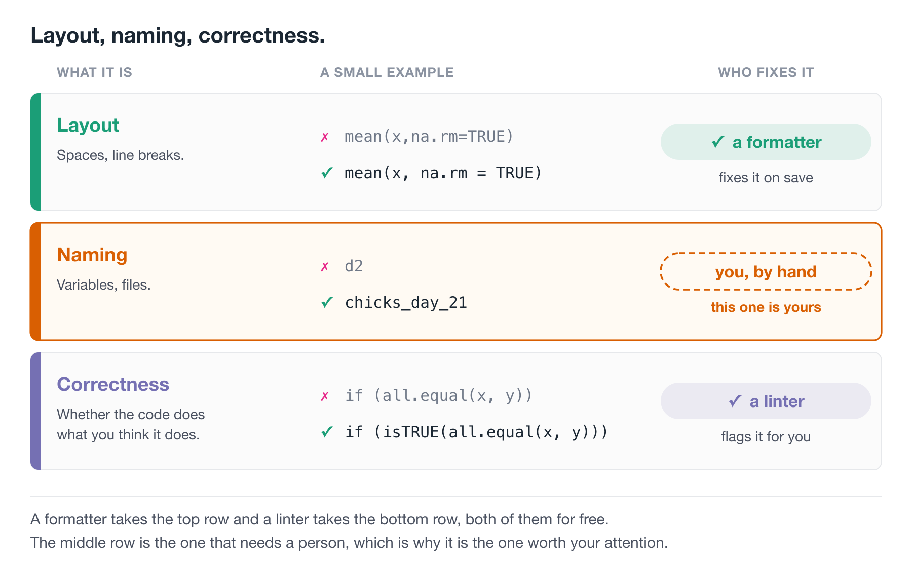
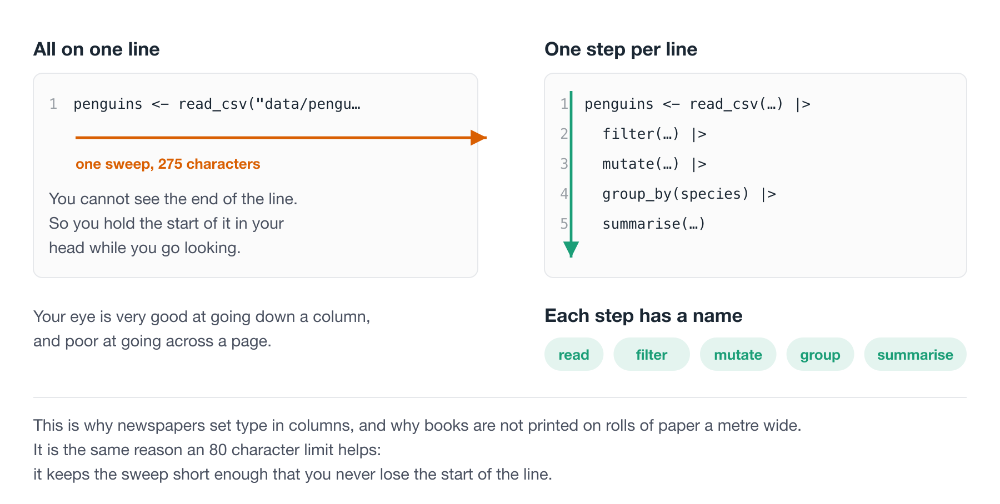
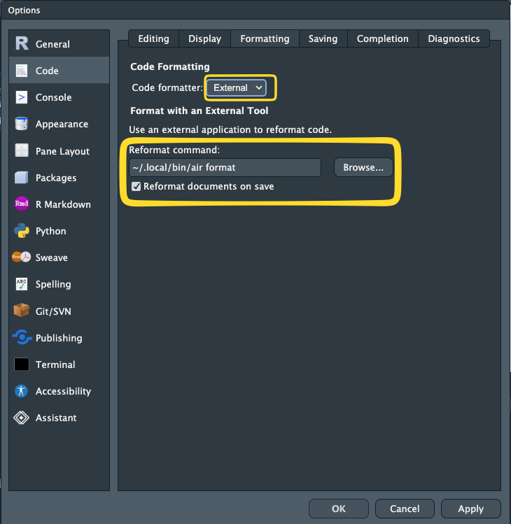
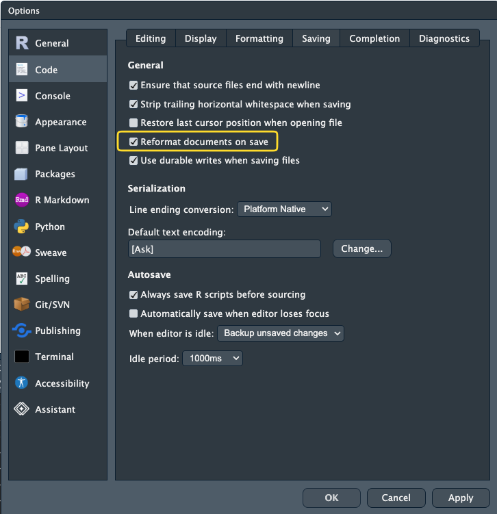
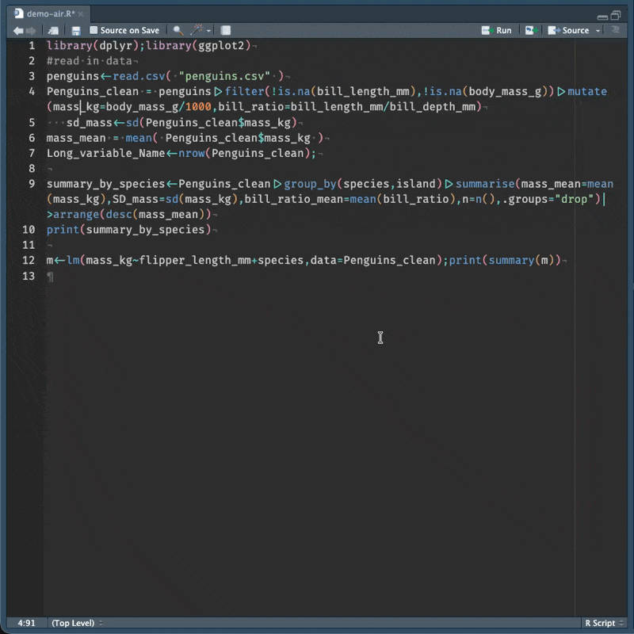
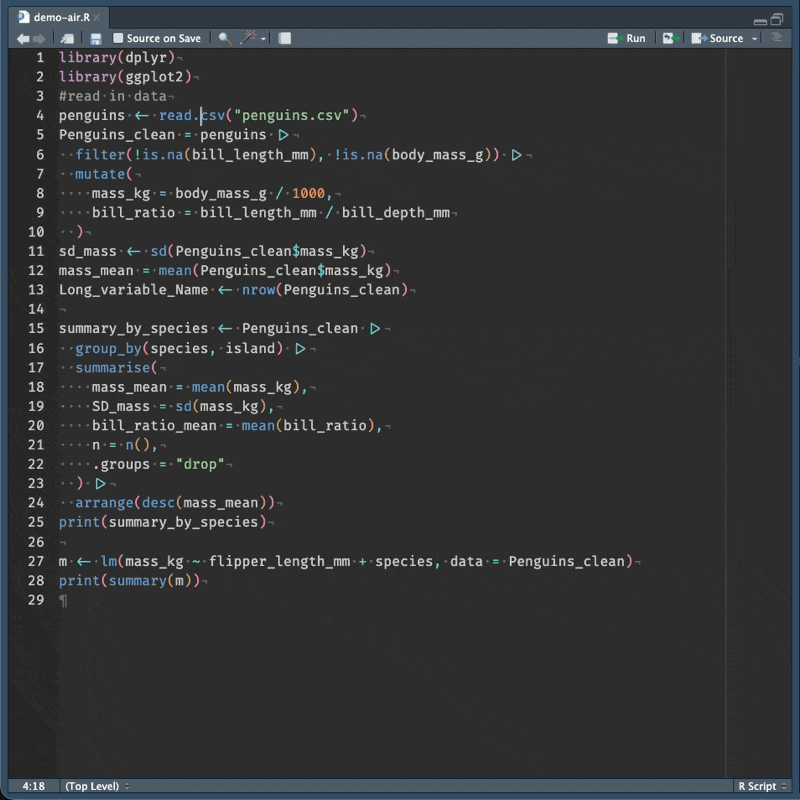
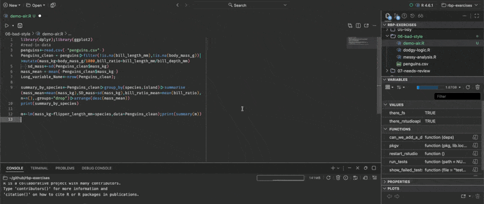
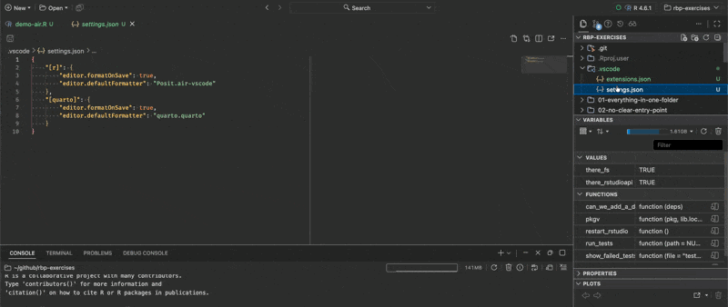
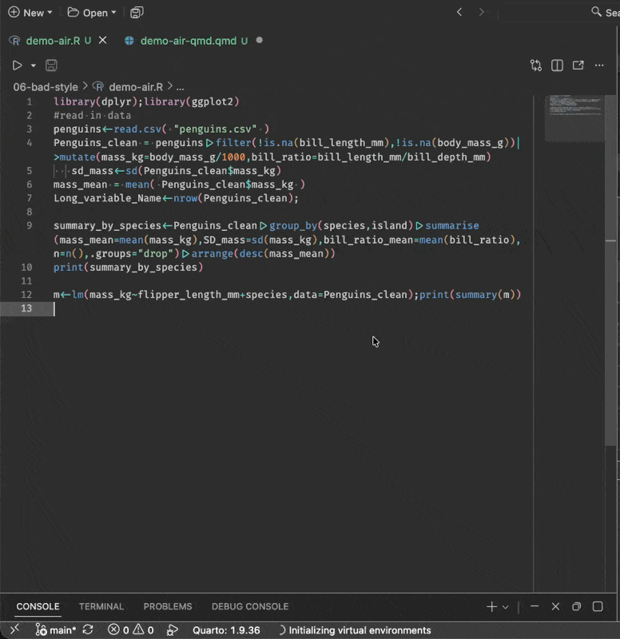
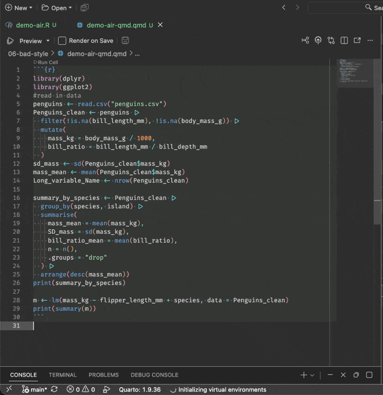

# Code style and readability {#sec-code-style}

> Good coding style is like correct punctuation: you can manage without it, butitsuremakesthingseasiertoread.
>
> -- [Hadley Wickham](https://hadley.nz/):

There is more to your code than having it run. We are aiming for your code to be "running" AND "easy to read, and easy to understand".

There are some really useful tools we can apply to get quick wins on improving the readability of your code. In this section we will discuss concepts of **code style**, talking about how to easily improve code **layout (whitespace, newlines, punctuation standards)**, and improving code with **code linting** - where a program looks at how your code is written and identifies common errors, style inconsistencies, and other known problem patterns.

::: {.overview}

## Overview {.unnumbered}

**Duration** 45 minutes

**Questions**

<!-- These map onto the sections below, in order. If you move a section, move its question. -->

- Why does style matter, if the code runs either way?
- What counts as style: layout, naming, or correctness?
- How should I lay out a pipeline, and what should I call things?
- What is a code formatter, and how do I get one to run on save?
- What is a linter, and what does it catch that a formatter does not?

:::

## Reading things that are hard to read is hard

Which of these is easier to read?

:::{.panel-tabset}

## quote 1

> i dont understan an ingle werd sumtimes of wot i say, but it is becoz i am so cleva

-- Oscar Wilde, The Happy Prince and Other Stories

## quote 2

> I am so clever that sometimes I don't understand a single word of what I am saying

-- Oscar Wilde, The Happy Prince and Other Stories

:::

One of these is harder to read than the other. It is easier to read the text that has correct spelling and grammar.

Punctuation is an example of grammar - it plays a role in deciding what the words mean.

Here is [Lionel Hutz](https://en.wikipedia.org/wiki/Lionel_Hutz), from [The Simpsons](https://en.wikipedia.org/wiki/The_Simpsons), attorney at law.

::: {.panel-tabset}

## The card

{fig-alt="A business card reading: Lionel Hutz, Esq. Works on contingency. No money down. Phone: 555-0189." width=70%}

## Marked up

{fig-alt="The same business card, with three marks added in red pen: a question mark after contingency, a comma after no, and an exclamation mark after down." width=70%}

:::

The punctuation changed the meaning! 

You can still work out what it says. But you spend energy doing it. Our precious mental energy. 


We want our code to be easier to understand, when we're reading a big lump of text:

::: {.panel-tabset}

## As it arrived

> we ran the model on the new data and it's results where different to what we expected. the team thought maybe the cleaning script had changed But after checking, changed it had not. Their was one column read in as character not a number, which meant the mean was computed over text and returned NA this is the kind of thing thats easy to miss when your reading quickly

## Tidied up

> We ran the model on the new data, and its results were different to what we expected. The team thought maybe the cleaning script had changed, but after checking, it had not. There was one column read in as a character rather than a number, which meant the mean was computed over text and returned `NA`. This is the kind of thing that is easy to miss when you are reading quickly.

:::

Both say the same thing. The second one you read once.

Going through the first, you were doing unpaid work the whole way - and these little bumps interrupt your thinking:

- Silently correcting "their" to "there".
- Has a sentence ended? There was a capital letter.
- Re-reading the sentence, it sounds backwards.

Our energy and our attention are finite resources, and if we spend them on these smaller things, then we will spend less energy on the goal: understanding the meaning.

### CPU cycles vs mental cycles

A computer has CPU cycles, and we spend real effort saving them - avoiding a copy of a big object, shaving milliseconds off something that runs a thousand times.

You have **mental cycles** too, and yours are far more expensive.

So: terse code saves the machine a tenth of a second, and then you spend an extra minute reading it every time you come back. Nothing got faster. The work moved off the machine, which has cycles to spare, and onto you, who does not.

**Spend the computer's freely. Guard your own.**

Code is the same, and R has its own version of the Hutz card:

```{r}
x <- 1
x < -1
```

The first line assigns `1` to `x`. The second asks whether `x` is less than negative one. One space, and a completely different meaning.

R accepted both without complaint, which is the whole problem.

Both of these take the chicks at day 21, and ask which diets came out above the average weight.

```{r}
#| message: false
library(tidyverse)
d<-ChickWeight
M<-mean(d$weight)
d<-d|>filter(Time==21)
r<-d|>group_by(Diet)|>summarise(m=mean(weight),n=n())|>arrange(desc(m))|>mutate(f=m>M)
r
```

```{r}
library(tidyverse)

overall_mean <- mean(ChickWeight$weight)

chicks_day_21 <- ChickWeight |>
  filter(Time == 21)

diet_summary <- chicks_day_21 |>
  group_by(Diet) |>
  summarise(
    weight_mean = mean(weight),
    n_chicks = n()
  ) |>
  arrange(desc(weight_mean)) |>
  mutate(above_overall_mean = weight_mean > overall_mean)

diet_summary
```

These both run. R does not care where you put your spaces. R does not care that your variables are short, that your code is very long-winded. Or short-winded.

But you care about these things - every stray space, and every inconsistent name is one more small correction you make before you can get at what the code is trying to do.

You are spending your mental cycles on this problem. It would be nice if you didn't have to do that.

### Both of those are wrong

Let's look closely at that last column. Every diet is above the overall mean. Weird?
This happens because the overall mean is taken from `ChickWeight` **before** the filter. It is the average weight across every day of the study - day 0 chicks included, when they weighed about 40 grams. Every day 21 chick clears that easily.

```{r}
mean(ChickWeight$weight) # every day
mean(ChickWeight$weight[ChickWeight$Time == 21]) # day 21 only
```

**Both versions have the bug.** Good layout doesn't fix the bug, but it makes it (in my opinion!) easier to notice. `M` and `m` tell you nothing, so there is nothing to be suspicious about. `overall_mean` and `weight_mean` sitting on the same line, makes us ask: the overall mean of *what*?

The style helps buy back some of your attention.

And that is part of what this lesson is about - there are ways to automate a lot of this! And there are ways to turn the rest into a habit, so it stops being a decision you make every time you write a line.

Nearly all of that surface level noise is systematic, which means we can get rid of it systematically.

And once it's gone, your attention goes to the part that actually needs you: whether the code does the right thing. 

## Style is like grammar

Style guides define a set of rules that keep code easy to read. To quote [Hadley Wickham](https://hadley.nz/):

> Good coding style is like correct punctuation: you can manage without it, butitsuremakesthingseasiertoread.

### Style: layout, naming, correctness

It helps to split "style" into two parts, because they need very different things from you.

**Layout.** Where the spaces go, where the line breaks go, how deep the indentation is, how a long function call gets split across lines.

```r
# layout
mean(x,na.rm=TRUE)
mean(x, na.rm = TRUE)
```

This part is completely mechanical, and a tool can do all of it.

**Naming.** What you call your variables, your functions, and your files.

```r
# naming
d2 <- d[d$Time == 21, ]
chicks_day_21 <- ChickWeight[ChickWeight$Time == 21, ]
```

This one is yours, because a name is a decision about meaning.

There is a third thing that is not style at all, but often gets lumped in with it.

**Correctness.** Whether your code actually does what you think it does.

This one is worth doing slowly, with two examples, because the failures are quiet.

**Comparing two numbers.** You would think this is safe:

```{r}
0.1 + 0.2 == 0.3
```

No! Those numbers are stored as binary approximations and the answer is a hair off:

```{r}
0.1 + 0.2 - 0.3
```

So you reach for `all.equal()`, which allows a small tolerance:

```{r}
all.equal(0.1 + 0.2, 0.3)
```

Good. Now watch what it does when the two things are genuinely different:

```{r}
all.equal(1, 2)
```

It does not return `FALSE`. It returns **a sentence**. And `if()` cannot do anything with a sentence:

```{r}
#| error: true
if (all.equal(1, 2)) "same" else "different"
```

The fix is `isTRUE()`, which asks the narrower question "is this exactly `TRUE`":

```{r}
if (isTRUE(all.equal(1, 2))) "same" else "different"
```

**What that means in an analysis.** While the two values agree, `all.equal()` returns `TRUE`, your `if` works, and you never learn there is a problem. It only breaks on the day the values differ - which is precisely the day you wrote the check for.

**Recoding a factor.** Here is one that does not error at all:

```{r}
grade <- factor(c("low", "high", "low"))
ifelse(grade == "low", grade, "other")
```

You asked for `"low"` and got `"2"`. A factor is stored as integers with labels attached:

```{r}
as.integer(grade)
levels(grade)
```

`ifelse()` drops the labels and hands back the bare codes. So `"low"` became `"2"`, its position in the alphabetical list of levels.

**What that means in an analysis.** Nothing warns you. You now have a column where a category has been replaced by its alphabetical rank, and every join, plot and table built on it downstream is quietly wrong. Add a new level next year and the numbers all shift.

`dplyr::if_else()` is stricter about types and keeps the factor:

```{r}
dplyr::if_else(grade == "low", grade, factor("other"))
```

Both of those problems are laid out perfectly well. Every space is in the right place. A formatter has nothing to say about either of them, and neither does a careful read, most days. That is a *linter's* job, and we come back to it later in this chapter.

So.

- Layout is automatable
- Naming is yours
- Correctness is a different tool

{fig-alt="Three rows, each with an example and the thing that fixes it. Layout - spaces, line breaks: mean(x,na.rm=TRUE) becomes mean(x, na.rm = TRUE), and a formatter fixes it on save. Naming - variables, files: d2 becomes chicks_day_21, and the row is outlined in orange with a dashed badge reading you, by hand, this one is yours. Correctness, whether the code does what you think it does: if (all.equal(x, y)) becomes if (isTRUE(all.equal(x, y))), and a linter flags it for you. The middle row is the one that needs a person." width=100%}

Let's get into it.

## Layout

Lines are free. Use them.

::: {.callout-note title="Your Turn: a quick check on pipes"}

Everything from here on uses the pipe, `|>`, so let's make sure we are all in the same place before we start.

- Have you used `|>`, or `%>%`, before?
- Could you say out loud what this does?

```r
penguins |> filter(species == "Adelie")
```

I like to read the pipe as **then**:

> Take the penguins data, **then** filter it to the rows where species is "Adelie".

The pipe gets a proper treatment in [Workflow: code style](https://r4ds.hadley.nz/workflow-style.html) in *R for Data Science*. It's a great book!

:::

Let's look at the same code twice.

::: {.panel-tabset}

## Hard work

```r
penguin_summary<-penguins|>filter(!is.na(bill_len))|>group_by(species,island)|>
summarise(bill_mean=mean(bill_len),bill_sd=sd(bill_len),n=n())
```

## Easy work

```r
penguin_summary <- penguins |>
  filter(!is.na(bill_len)) |>
  group_by(species, island) |>
  summarise(
    bill_mean = mean(bill_len),
    bill_sd = sd(bill_len),
    n = n()
  )
```

## No pipe at all

```r
penguin_summary <- summarise(
  group_by(
    filter(penguins, !is.na(bill_len)),
    species,
    island
  ),
  bill_mean = mean(bill_len),
  bill_sd = sd(bill_len),
  n = n()
)
```

:::

All three give the same answer. R sees no difference at all.

But in the second one you can see the shape of the analysis:

- filter()
- group_by()
- summarise()

Three steps, one per line, each indented to show it belongs to the pipeline.

In the first one you have to parse it yourself, character by character, before you can even start thinking about whether the analysis is right.

The third one is the interesting case, because it is the one that looks fine. Every space is in the right place, the indentation is correct, and a formatter would leave it exactly as it is.

It is still harder to read, because the steps now run inside out. `filter()` happens first and sits deepest. `summarise()` happens last and sits at the top. To read it you have to find the innermost bracket, then work your way out, holding each layer in your head as you go. To read the pipe version you start at the top and go down.

That is a different problem from layout, and no formatter will fix it for you. It is also where rainbow parentheses start earning their keep - once you are three or four brackets deep, matching them by eye becomes its own small job, on top of the actual work.

::: {.callout-note title="Your Turn"}

Take this and work out, by reading alone, what it produces:

```r
x<-lm(body_mass~flipper_len+species,data=penguins[penguins$year==2008&!is.na(penguins$sex),])
```

1. How many things are being filtered out?
2. What is the response variable?
3. How long did that take you?
4. How would you rewrite this?

:::

### The one line special

I once saw someone writing code where the goal, as far as I could tell, was to have as few lines as possible.

Not fewer *steps*. Fewer *lines*.

It was an entire analysis. Read the data in, reshape it, fit a model, draw a plot, save it. Four lines.

Have a look at both of these, and see which one you would rather open on a Monday morning.

::: {.panel-tabset}

## Four lines

```r
penguins <- read_csv("data/penguins.csv") |> filter(!is.na(bill_length_mm), !is.na(body_mass_g)) |> mutate(mass_kg = body_mass_g / 1000, bill_ratio = bill_length_mm / bill_depth_mm) |> group_by(species) |> mutate(mass_z = (mass_kg - mean(mass_kg)) / sd(mass_kg)) |> ungroup()
fit <- lm(mass_kg ~ bill_ratio + species + island, data = penguins)
p <- ggplot(penguins, aes(x = bill_ratio, y = mass_kg, colour = species)) + geom_point(alpha = 0.6) + geom_smooth(method = "lm", se = FALSE) + facet_wrap(~island) + labs(x = "Bill length / bill depth", y = "Body mass (kg)") + theme_minimal(base_size = 12)
ggsave("output/figures/mass-bill-ratio.png", p, width = 8, height = 5, dpi = 300)
```

## The same thing, laid out

```r
penguins <- read_csv("data/penguins.csv") |>
  filter(
    !is.na(bill_length_mm),
    !is.na(body_mass_g)
  ) |>
  mutate(
    mass_kg = body_mass_g / 1000,
    bill_ratio = bill_length_mm / bill_depth_mm
  ) |>
  group_by(species) |>
  mutate(mass_z = (mass_kg - mean(mass_kg)) / sd(mass_kg)) |>
  ungroup()

fit <- lm(mass_kg ~ bill_ratio + species + island, data = penguins)

p <- ggplot(penguins, aes(x = bill_ratio, y = mass_kg, colour = species)) +
  geom_point(alpha = 0.6) +
  geom_smooth(method = "lm", se = FALSE) +
  facet_wrap(~island) +
  labs(
    x = "Bill length / bill depth",
    y = "Body mass (kg)"
  ) +
  theme_minimal(base_size = 12)

ggsave(
  "output/figures/mass-bill-ratio.png",
  p,
  width = 8,
  height = 5,
  dpi = 300
)
```

:::

{fig-alt="The same analysis two ways. As one long line the eye makes a single wide sweep and has to hold the start of the line in memory to reach the end. Broken one step per line, the eye makes five short downward steps, and each step can be named: read, filter, mutate, group, summarise." width=100%}

Same code. Same results.

But look at what your eye can do with the second one. You can run down the left hand edge and read the steps off like a list: filter, mutate, group by, mutate, ungroup.

Your eye is very good at scanning down a column. It is terrible at scanning across a page, which is why newspapers use columns and why books are not printed on rolls of paper a metre wide.

The first version makes you do the horizontal thing. On a laptop you cannot even see the end of those lines without scrolling sideways, so you are holding the start of the line in your head while you go looking for the end of it.

Those are mental cycles, and you are burning them on the shape of the code rather than on the analysis.

There is a second thing that shows up the moment something breaks. R tells you which line the error is on. In the first version that is not much help, because a quarter of your analysis is on that line.

Lines are free. Use them.

## Naming

This is the half of style that a formatter cannot help you with.

Pick a convention, `snake_case`, `camelCase`, or `CamelCase`, and stick to it. I prefer `snake_case` because I find it easier to read, but the choice matters far less than the consistency.

Consistency matters for a reason more concrete than tidiness. Compare:

```r
weight_mean <- mean(ChickWeight$weight)
sd_weight <- sd(ChickWeight$weight)
```

with:

```r
weight_mean <- mean(ChickWeight$weight)
weight_sd <- sd(ChickWeight$weight)
```

The first pair changes the order of the naming. The second sticks to one pattern, `variable_operation`, where the first word says what we measured and the second says what we did to it.

Why does that help? **Tab complete.**

If I am consistent, I can type `weight_` and press tab, and R tells me every single thing I have done to `weight`.

<!-- GIF NEEDED: typing `weight_` in the console and hitting tab, showing the
     completion list fill with weight_mean, weight_sd, weight_median. This one
     is genuinely satisfying to watch, so it's worth capturing properly. -->

If I had chosen the other order, `sd_` would tell me everything I have taken a standard deviation of:

```r
sd_weight <- sd(ChickWeight$weight)
sd_time <- sd(ChickWeight$Time)
```

Either order is fine. What you can't do is mix them.

Because then you have to *remember* which way round you named each thing, and that's exactly the kind of small tax that makes code tiring to work with.

::: {.panel-tabset}


## Inconsistent

```r
sd_Weight
SD_weight
Long_variable_Name
timeSD
```


## Consistent

```r
weight_mean
weight_sd
time_mean
time_sd
```

:::

## Read a style guide, once

It's worth your time to read through a style guide once. Properly, start to finish, one time.

You'll notice things in your own code that you didn't see before, and you'll see other people's code differently. It's a bit like learning about [kerning](https://xkcd.com/1015/).

Once you see it, you notice it everywhere.

::: {.callout-note title="Your Turn"}

Read the [style chapter of Advanced R, 1st edition](http://adv-r.had.co.nz/Style.html). It is short, and you can get through it in about ten minutes.

As you read, keep a list of the rules you are currently breaking. Don't fix anything yet.

:::

::: {.callout-tip title="Going deeper" collapse="true"}

When you have more time, read sections 1 to 5 of the [Tidyverse style guide](https://style.tidyverse.org/): files, syntax, functions, pipes, and ggplot2.

It is the more complete treatment, and it explains the reasoning behind each rule rather than just stating it.

The [files chapter](https://style.tidyverse.org/files.html) is worth reading alongside the project organisation lesson, because it is really about project structure rather than code.

:::

## Do I have to do all this by hand?

No. And you shouldn't.

If you try to apply a style guide by hand you will spend your time putting spaces after commas, lining up arguments, and re-indenting things you just moved. It is tedious, and you will do it inconsistently, because it is exactly the kind of task humans are bad at and get bored by.

Worse, you'll do it *instead of* the analysis.

The good news is that layout is mechanical, and mechanical things can be automated.

## Using the {air} formatter

[Air](https://posit-dev.github.io/air/) is an R formatter from Posit. You point it at your code, and it lays it out properly. It is basically magic.

Once you have it wired into your editor, you stop thinking about layout. You type whatever comes out of your head, hit save, and it comes out tidy. You don't need to spend another moment going over your code tweaking spaces.

### Checking air is installed

You installed air in the setup chapter - [Code formatters](setup.qmd#sec-code-formatters). We just need to check it is there, and find out where it lives.

::: {.callout-note title="Your Turn: check air is installed"}

1. Open a terminal. In RStudio that's the Terminal tab, next to the Console.
2. Run `air --version` and check you get a number back.
3. Run `which air` on macOS or Linux, or `where air` on Windows, and **write the path down**. You need it in a minute.

If you get "command not found", the install didn't finish - go back to [Code formatters](setup.qmd#sec-code-formatters) and run it again.

If it won't install, don't spend the whole session fighting it. Use `{styler}` for today, and come back to air later.

:::

### If you can't install air, use {styler}

If you can't install {air} because of network issues, use [`{styler}`](https://styler.r-lib.org/). This is an R package that pre dates {air}. Install it with:

```r
install.packages("styler")
```

It follows the same tidyverse style guide air does, so the output is very close. 

There are a few differences between air and styler, basically: air is faster, and it is less configurable.

## Format on save (aka magic)

This changes how you work!

Once this is set up, you write code however it falls out of your head. Wonky spacing, arguments strewn across the line, indentation all over the place. Do not fix any of it.

Hit `Cmd / Ctrl + S`, and it is all just correct.

I cannot really oversell this. 

::: {.panel-tabset}

## RStudio

You need RStudio 2024.12.0 or later.

You want the path you wrote down a moment ago, from `which air` or `where air`.

Go: Tools → Global Options → Code → Formatting.

- For {air} Set **Code formatter** to **External**.

- For {styler} Set **Code formatter** to **Styler**.

Set **Reformat command** to your air path followed by `format`, so something like `/Users/nick/.local/bin/air format`. If your path has spaces in it, wrap it in double quotes.

{fig-alt="RStudio's Options window, on the Code section and the Formatting tab. Code formatter is set to External, highlighted. Below it the Reformat command box contains ~/.local/bin/air format, and Reformat documents on save is ticked, both highlighted together."}

Now turn on format on save. Go: Tools → Global Options → Code → Saving, and tick **Reformat documents on save**.

{fig-alt="RStudio's Options window, on the Code section and the Saving tab. Under General, Reformat documents on save is ticked and highlighted, sitting among the other saving options such as ensuring source files end with a newline and stripping trailing whitespace."}

::: {.content-visible when-format="html"}

{fig-alt="An animation of format on save in RStudio. The script starts crammed together - two library calls on one line, no spaces around the assignment arrows or the commas, and pipelines running past the edge of the editor. On save, the whole file reflows: one statement per line, spaces around every operator, and each step of the pipeline on its own indented line. Nothing about what the code does has changed."}

:::

::: {.content-visible when-format="pdf"}

{fig-alt="An RStudio editor showing the demo script after air has formatted it. The two library calls are on separate lines, every operator has a space around it, and the pipeline is broken one step per line with each step indented under the object it works on."}

:::

## Positron

Air comes with Positron, so there is nothing to install.

Open the command palette (`Cmd/Ctrl + Shift + P`) and run **Air: Initialize Workspace Folder**. This writes the recommended settings into your project.

::: {.content-visible when-format="html"}

{fig-alt="An animation in Positron, with the unformatted demo-air.R open from the 06-bad-style folder. Running Air: Initialize Workspace Folder from the command palette writes the recommended settings into the project, after which saving the file reformats it."}

:::

::: {.content-visible when-format="pdf"}

{fig-alt="Positron showing the settings.json file that Air: Initialize Workspace Folder has just created under .vscode in the project. It sets formatOnSave to true for R files with the Posit air formatter, and again for Quarto files with the Quarto formatter."}

:::

If you'd rather do it by hand, add this to your `settings.json`:

```json
{
  "[r]": {
    "editor.formatOnSave": true,
    "editor.defaultFormatter": "Posit.air-vscode"
  }
}
```

For R chunks inside Quarto documents, add the Quarto formatter too:

```json
{
  "[quarto]": {
    "editor.formatOnSave": true,
    "editor.defaultFormatter": "quarto.quarto"
  }
}
```

::: {.content-visible when-format="html"}

{fig-alt="An animation in Positron with two tabs open, demo-air.R and demo-air-qmd.qmd. With the Quarto formatter configured, saving the Quarto document reformats the R code inside its chunks, which is the thing RStudio will not do."}

:::

::: {.content-visible when-format="pdf"}

{fig-alt="Positron showing demo-air-qmd.qmd with an R chunk that air has just formatted on save. The library calls are on their own lines and the pipeline is broken one step per line, inside the chunk fences."}

:::

:::

::: {.callout-tip title="Setting it up from R"}

If you're inside a project already, this does most of the work for you:

```r
usethis::use_air()
```

It sets up the editor configuration and adds an `air.toml` to your project, which gives you some options to customise air. 

This isn't mandatory, but can be useful.

:::

::: {.callout-note title="Your Turn: the good bit"}

1. Set up format on save in your editor, using the tabs above.
2. Open any R script. Make a mess of it on purpose. Delete the spaces around a `<-`, jam some arguments together, break the indentation.
3. Hit `Cmd / Ctrl + S`.
4. Do that three or four more times, with a different kind of mess each time,

I want you to do it repeatedly, because you don't have to tidy your own code, and that's awesome.

:::

### Formatting a file, or a whole project

You don't need format on save, or even an editor. Both tools will format one file, or everything at once.

::: {.panel-tabset}

## air

Air will format a single file:

```bash
air format analysis/01-clean-data.R
```

or an entire project:

```bash
air format .
```

That second one is the command I run most. It is also the one worth putting in front of any code review, so that nobody spends their attention on spacing.

## styler

Styler does the same two jobs from inside R, so there is no terminal involved:

```r
styler::style_file("analysis/01-clean-data.R")
styler::style_dir(".")
```

:::

::: {.callout-note title="Your Turn"}

There is a deliberately awful script in the course repository at `06-bad-style/messy-analysis.R`. It breaks essentially every rule in this chapter.

1. Open `messy-analysis.R` and read it. Note how long it takes you to work out what it does.
2. Format it with air or styler.
3. Read it again. What can you see now that you couldn't before?
4. Look at the variable names in the formatted version. Air has not touched a single one of them, and they're still a mess. Write down three you would rename.

:::

::: {.callout-note title="Notes on using air" collapse="true"}

A few things that will save you some confusion.

**There is very little to configure, and that's on purpose.** Air's settings live in an `air.toml` file, and there are about ten of them. The ones you might actually change are `line-width` (default 80) and `indent-width` (default 2). There is no way to spend an afternoon tuning it, which is exactly why I like it.

**It won't work on an untitled tab.** Air needs a file that exists on disk, with an `.R` extension, so that it knows it's looking at R code. Save the file first.

**In RStudio it won't work inside R chunks in Quarto or R Markdown.** This is an RStudio limitation rather than an air one, and it may well change. Positron handles chunks fine.

**If your code doesn't reformat, you probably have a syntax error.** Air will not format code it cannot parse. So a file that stubbornly refuses to tidy up is telling you something useful. Go and find your missing bracket.

That last one turns out to be a small free bonus. Format on save quietly becomes a syntax check on save.

:::

## Using linters

Air has now taken care of how your code *looks*. Here is a piece of code where that isn't the problem.

```r
sites <- character(0)

for (i in 1:length(sites)) {
  message("Processing site ", sites[i])
}
```

Air is perfectly happy with that. Every space is in the right place, the indentation is correct, and running `air format` on it changes nothing at all.

It is also broken.

When `sites` is empty, `length(sites)` is `0`, and `1:0` does not give you nothing. It gives you this:

```{r}
sites <- character(0)
1:length(sites)
```

So the loop runs twice, on elements `1` and `0`, neither of which exists. No error, no warning, and a message about a site that isn't there.

This is a different kind of problem, and it needs a different kind of tool.

- A **formatter** changes how your code *looks*. `{air}` doesn't care what your code does.
- A **linter** tells you what your code might be doing *wrong*. It reads your code without running it, which is called static analysis, and flags errors, bugs, and suspicious patterns.

You want both. Formatting settles arguments about layout. Linting catches the class of mistake that runs perfectly happily and gives you the wrong answer.

::: {.callout-caution title="Some history: why is it called a linter?" collapse="true"}

The name comes from a program called `lint`, written by Stephen C. Johnson at Bell Labs in 1978 to check C code for bugs and portability problems. You can read more on the [Wikipedia page for lint](https://en.wikipedia.org/wiki/Lint_(software)).

Lint is the fluff that clothes shed in the wash, and a clothes dryer has a lint trap to catch it. Johnson's idea was that his program would work the same way, catching the waste fibres while leaving the fabric intact.

Your code is the fabric. The linter is the trap.

I like this because it sets the right expectation. A lint trap does not tell you the jumper was a bad idea. It picks off the fluff, and it does it every single load, without being asked.

:::

### jarl

[Jarl](https://jarl.etiennebacher.com/), which stands for Just Another R Linter, is a fast linter by [Etienne Bacher](https://www.etiennebacher.com/). It is built on top of Air, which is why the two feel like the same tool.

Here is a script of the kind most of us have written. Nothing exotic. Read some data in, flag a few things, print a message.

```r
penguins <- read.csv("data/penguins.csv")

missing_mass <- penguins$body_mass_g == NA

penguins$heavy <- ifelse(penguins$body_mass_g > 5000, T, F)

has_data <- nrow(penguins) > 0

if (has_data == TRUE) {
  message("Loaded ", nrow(penguins), " penguins")
}
```

Air has no complaints. It runs without an error.

Point a linter at it, though, and you get three warnings. Use whichever of these you have:

::: {.panel-tabset}

## jarl

```bash
$ jarl check penguin-check.R
```

## flir

```r
flir::lint("penguin-check.R")
```

:::

```
warning: equals_na
 --> penguin-check.R:3:17
  |
3 | missing_mass <- penguins$body_mass_g == NA
  |                 -------------------------- Comparing to NA with `==`, `!=` or `%in%` is problematic.
  |
  = help: Use `is.na()` instead.

warning: true_false_symbol
 --> penguin-check.R:5:55
  |
5 | penguins$heavy <- ifelse(penguins$body_mass_g > 5000, T, F)
  |                                                       - `T` and `F` can be confused with variable names.
  |

warning: redundant_equals
 --> penguin-check.R:9:5
  |
9 | if (has_data == TRUE) {
  |     ---------------- Using == on a logical vector is redundant.
  |
```

Let's take those one at a time, because each one teaches something.

**`missing_mass <- penguins$body_mass_g == NA`**

This is the one I want you to remember. It looks completely reasonable, and it is always wrong.

`NA` means "I don't know". So asking "is this value equal to a value I don't know?" can only be answered with "I don't know":

```{r}
x <- c(1, NA, 3)
x == NA
```

Every answer is `NA`, including for the values that are obviously not missing. Your `missing_mass` vector contains no information at all! Note that jarl even told you want to do!

```{r}
is.na(x)
```

That's the function you wanted.

**`ifelse(..., T, F)`**

`TRUE` and `FALSE` are reserved words in R. `T` and `F` are just ordinary variables that happen to start out holding `TRUE` and `FALSE`, which means anyone can reassign them.

```{r}
T <- FALSE
mean(c(1, NA, 3), na.rm = T)
rm(T)
```

`na.rm = T` quietly became `na.rm = FALSE`, and the mean is now `NA`. Spell them out and this cannot happen to you.

**`if (has_data == TRUE)`**

`has_data` is already `TRUE` or `FALSE`. Comparing it to `TRUE` gets you back exactly what you started with, so `if (has_data)` says the same thing with less to read.

This one is not a bug. It is a mental cycle.

::: {.callout-important title="Two nastier ones, for later" collapse="true"}

These are much harder to spot by eye.

`class(dat) == "data.frame"` looks fine until you meet an object with more than one class:

```{r}
class(data.frame(x = 1))
class(datasets::ChickWeight)
```

One class for a plain data frame, four for that one. So the comparison hands `if()` four answers where it wanted one, and errors. `inherits(dat, "data.frame")` asks the question you actually meant.

`if (all.equal(x, y))` is worse. `all.equal()` returns `TRUE` when things match, and a *description of the difference* when they don't:

```{r}
all.equal(1, 1)
all.equal(1, 1.1)
```

`if()` can't do anything sensible with it. So the code works perfectly while your values match, and falls over the first time they don't, which is precisely the case you wrote the check for. `isTRUE(all.equal(x, y))` fixes it. (demo).

:::

Notice that these fail in two different ways.

`== NA` and `na.rm = T` are **silent**. They run, there is no error and no warning, and the answer is wrong.

That is what a linter is for. Careful reading **could** catch all of these. But a tool catches them **every** time.

Where a fix is clear and safe, jarl or flir can apply it for you:

::: {.panel-tabset}

## jarl

```bash
$ jarl check penguin-check.R --fix
```

## flir

```r
flir::fix("penguin-check.R")
```

:::

which turns the `T` and `F` into `TRUE` and `FALSE`. It won't touch the `== NA`, because deciding what you actually meant there is your job, not the tool's.

It ships 55+ rules, integrates with VS Code, Positron and Zed, and runs in CI. It's also very fast. On the `dplyr` source, roughly 25,000 lines of R, the documented benchmark is 0.131 seconds against 18.5 seconds for `{lintr}`.

::: {.callout-tip title="What about lintr?" collapse="true"}

[`{lintr}`](https://lintr.r-lib.org/) is the long established R linter, it's pure R, and it's what you'll meet in most existing projects and CI setups. It's a perfectly good tool and knowing it is worthwhile.

Jarl is newer and much faster, which matters more than it sounds.

A linter you run on every save changes your habits.

Use something! Either one of them.

:::

### If you can't install jarl, use {flir}

Same story as air. Jarl is a command line tool, so the install can go wrong in all the same ways.

Your backup is [`{flir}`](https://flir.etiennebacher.com/), which is an ordinary R package:

```r
install.packages("flir")
```

It's by Etienne as well, and it's fast for the same sorts of reasons. The documented benchmark is 172 milliseconds against 3.44 seconds for `{lintr}` on the same code.

Two functions do the work:

```r
flir::lint("06-bad-style/dodgy-logic.R")
flir::fix("06-bad-style/dodgy-logic.R")
```

`lint()` tells you what it found. `fix()` applies the changes it's confident about, the same way `jarl check --fix` does.

Call them with `flir::` in front, as above. If you run `library(flir)` instead, its `fix()` will mask the `fix()` that comes with R, and you'll get a warning.

One thing you should know. Etienne has moved on to jarl, and says on the flir site that he won't be adding new rules to it. So flir is finished rather than growing.

For our purposes that's fine. It catches everything in this chapter, it installs anywhere R installs, and it fixes what it can.

::: {.callout-note title="Your Turn"}

Back to `06-bad-style/`. There's a second file there, `dodgy-logic.R`, which is formatted perfectly well and still wrong.

1. Read it, and see if you can spot the bug by eye. Give yourself two minutes.
2. Run `jarl check 06-bad-style/dodgy-logic.R`. If you don't have jarl, use `flir::lint("06-bad-style/dodgy-logic.R")` or `lintr::lint("06-bad-style/dodgy-logic.R")`.
3. Now run `jarl check` over your own most recent project. What comes up?

Nothing on that last one is a judgement. I run this over my own code and it finds things every time.

:::

::: {.callout-tip title="Read more"}

The style and naming material in this chapter is adapted from my blog post [How to get good with R](https://www.njtierney.com/posts/2023-10-30-how-to-get-good-with-r/#stick-to-a-style-guide).

:::

## Summary {.unnumbered}

- Badly laid out code makes you spend mental cycles on the surface before you get to the ideas, in the same way that bad spelling does.
- Mental cycles are worth more than computer cycles. Spend the machine's, guard your own.
- Lines are free. Use them, because your eye reads down far better than across.
- Pick a naming convention and stick to it, because consistency is what makes tab complete work for you.
- Read a style guide once, properly, and you'll see code differently afterwards.
- Set up `{air}` and format on save, then stop thinking about layout.
- A linter is a different tool again, and it catches the bugs that run perfectly happily.

Next, we look at readability beyond layout: names that carry meaning, breaking a wall of code into pieces, and how to review code.
