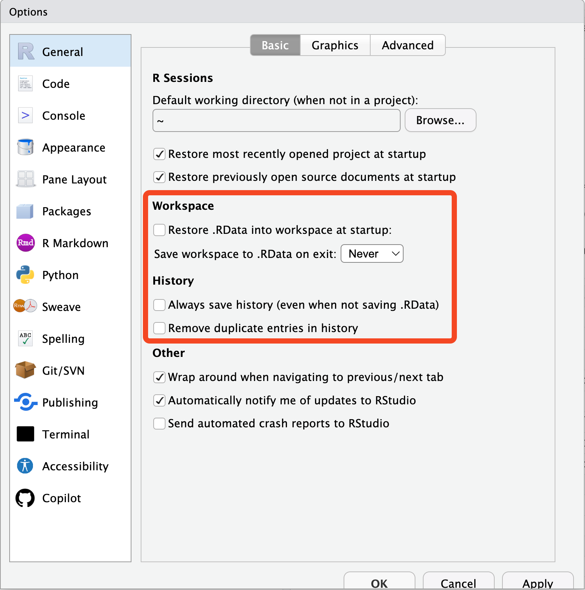
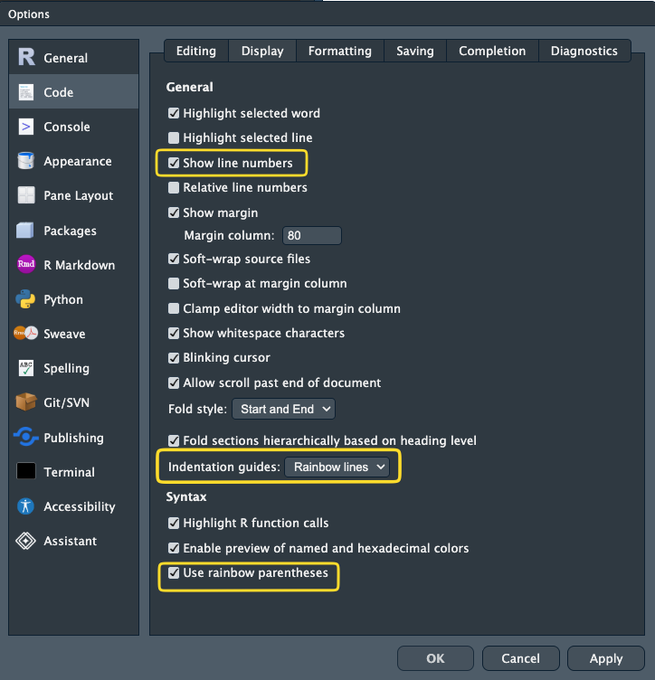
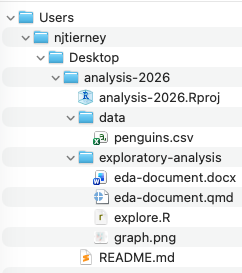
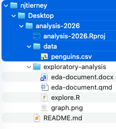
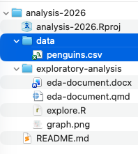
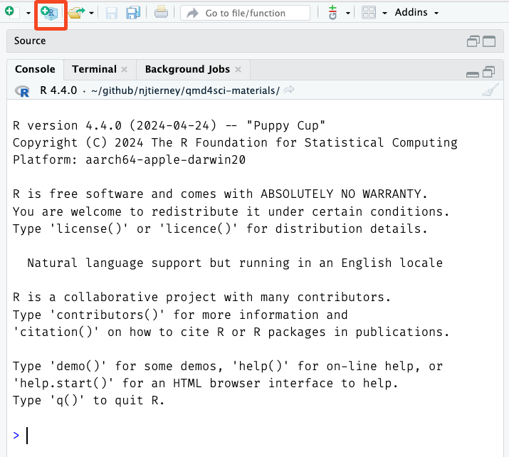
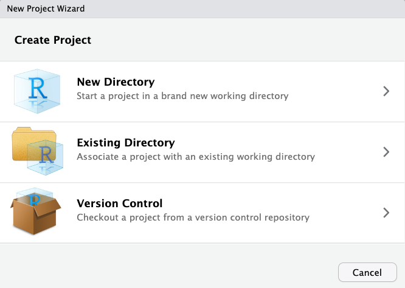
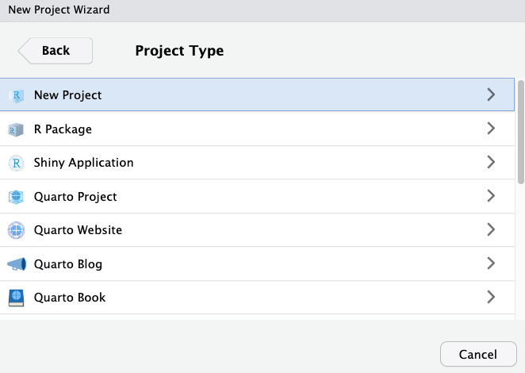
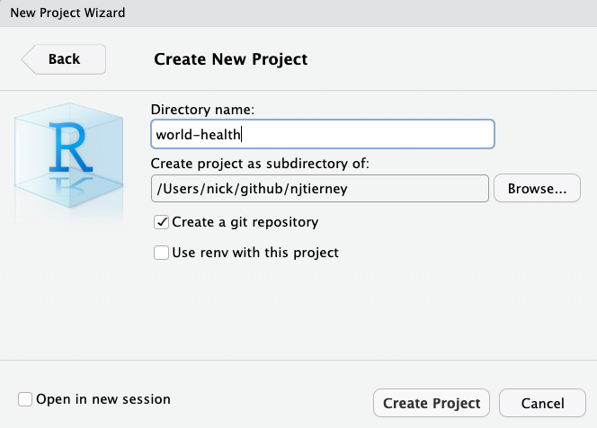

> "Remember, you are always collaborating with your future self."

This course is all about best practices in R. I want you to know the principles, and have practice at writing clear, maintainable, and reproducible R code.

To build these practices, you need a good, clean, base. We start by talking about basic "hygiene" for your projects and files, before moving on to how to organise your project, and some potential pitfalls.

Remember: your project doesn't have to be perfectly organised. Instead, we focus on making the next project a little better, each time.

# Overview {.unnumbered}

- **Duration** 60 minutes

<!-- Note: ensure these questions all map onto the concepts here and are answered by them, in order. -->

- **Questions**
  - How to set up RStudio or Positron
  - What is a file path?
  - What is a project, anyway?
  - Why organise your project?
  - What are some common project structures?
  - How do you organise your work?
  - What are "good enough" common sense principles of project organisation
  - Why should every project have a README?


## Getting set up

Go to [course exercises -@sec-rbp-exercises] and follow the instructions on downloading the course materials.

Let's talk about some easy-wins in how you set up RStudio and positron, to make it easier to make things reproducible.

We want to go to global options, like so:

Tools → Global Options (or `Cmd + ,` on macOS) → General.

Under **Workspace**:

- Uncheck **Restore .RData into workspace at startup**
- Set **Save workspace to .RData on exit** to **Never**

Under **History**:

- Uncheck **Always save history (even when not saving .RData)**
- Uncheck **Remove duplicate entries in history**

{fig-alt="Setting the options so you neither restore nor save your previous session's work." width=70%}

*Setting the options so you neither restore nor save your previous session's work.*

This matters for two reasons:

1. **Reproducibility.** You don't want old objects from your last analysis cluttering your session - and you also don't want to depend on them, accidentally.
2. **Privacy.** You really do not want private data written into a `.RData` file on disk. You want to read data in, deliberately, every time.

Your history is the list of commands you have typed. Not saving it means you won't come to rely on something you typed in a previous session - which is a good habit to build. You can also do this via the `{usethis}` package:

```{r}
#| eval: false
usethis::use_blank_slate()
```

Now when you restart R, it will always give you clean session. You should make a habit of restarting R and starting from scratch. If your code works from a clean session, you know it will works. And, if it doesn't work in a new session, you know you have a bug you need to solve.

There is event a keyboard shortcut to restart R - worth knowing about:

- **Restart R**: `Cmd/Ctrl + Shift + F10`

While you are in the settings, two more worth turning on:

- **Show line numbers** - you cannot discuss code you cannot point at.
- **Rainbow parentheses** - cheap insurance against a very common class of error.



::: {.callout-note title="Your Turn"}

There is a really neat feature in RStudio called the "Command Pallete" - it's kind of like "spotlight" or "search" for any setting in RStudio.

Try opening it and searching for "rainbow", using the keyboard shortcut:

- Windows: `Ctrl + Shift + P`
- Mac: `Cmd + Shift + P`

Try it now, and search for "rename file" and "rainbow":


Read more at [Posit's RStudio guide to the Command Palette](https://docs.posit.co/ide/user/ide/guide/ui/command-palette.html)

:::

## Positron

The same settings live under Settings → Extensions → R. The equivalent
behaviour is off by default, so there is usually nothing to change - but it is
worth looking, so you know where it is.

Positron also has the command palette! The same command as RStudio.

- Windows: `Ctrl + Shift + P`
- Mac: `Cmd + Shift + P`

<!-- SCREENSHOT NEEDED: Positron settings, Extensions > R, showing the
     workspace/restore options. -->


::: {.callout-note title="Your Turn"}

1. Turn off workspace saving using the settings above, or run `usethis::use_blank_slate()`.
2. Restart R with `Cmd/Ctrl + Shift + F10`.
3. Open your most recent analysis script and run it from the top in the clean session.
4. Did it work? If not - and it very often does not - that gap is exactly what the rest of this course is about.

:::


# A common problem: file paths^[This section draws from ["Workflow"](https://qmd4sci.njtierney.com/workflow.html) from my course: ["quarto for scientists"](https://qmd4sci.njtierney.com).]

Before we get into projects, and organising them, I really think it is worthwhile spending a bit of time talking about **file paths**.

I can almost guarantee that you have run into this problem:

```{r}
#| error: true
read.csv("my-very-important-data-file-somewhere.csv")
```

This error is R saying: 

> I do not know where "my-very-important-data-file-somewhere.csv" is.

There are lots of reasons that R doesn't know where that file could be - but the chances are that _you_ know exactly where it is, and now you need to get into the mind of R, to understand where it thinks it is.

We can resolve these errors if we keep our **files**, **paths**, and **directories** ordered. This goes together with a **workflow** for clearly, and portably letting R know where these are. This practice is referred to as **good file path hygiene**.

But we need to define a few of these terms: files, directories, and paths.

## Files, Directories, Paths

Below we show some examples of a folder structure, of directories, and files

```
Users --------------------------------------------->> Directory/
  `-- njtierney ----------------------------------->> Directory/
      `-- Desktop --------------------------------->> Directory/
          `-- analysis-2026 ----------------------->> Directory/
              |-- analysis-2026.Rproj -----< File
              |-- data ---------------------------->> Directory/
              |   `-- penguins.csv -------< File
              `-- exploratory-analysis ------------>> Directory/
              |   |-- explore.R ----------< File
              |   `-- eda-document.docx --< File
              |   `-- eda-document.qmd ---< File
              |   `-- graph.png ----------< File
              `-- README.md --------------< File
```

We can refer to a given location with a "path" - which we refer to as a "file path" or a "directory path" depending on which we are navigating to. Here are some examples of paths for two directories, and two files.

- `Users/njtierney/Desktop/analysis-2026/` - directory path of "analysis-2026"
- `Users/njtierney/Desktop/analysis-2026/README.md` - file path of "README.md"
- `Users/njtierney/Desktop/analysis-2026/data` - directory path of "data"
- `Users/njtierney/Desktop/analysis-2026/data/penguins.csv` - file path of "penguins.csv"

Let's talk a bit more about files, directories and paths.

### Files 📄

- Files are something I can open.
- These are all files: "explore.R", "eda-document.docx", "graph.png", "README.md", "penguins.csv"
- Files have "file extensions", which are the last characters after a `.`, and they tell us what kind of file they are:
  - "explore.R" ends with **.R**, it is an R script
  - "eda-document.docx" is a Microsoft Word Document, ".doc" is an older format
  - "graph.png" is an image (specifically, a ["PNG"](https://en.wikipedia.org/wiki/PNG))
  - "README.md" is a is a**m**ark**d**own text file.
  - "penguins.csv" is a "comma separated values" file

### Directories 📁

- Also known as folders. This comes from the image analogy of putting pieces of paper inside a folder.
- A directory contains files
- A directory can also contain directories

### Paths 🛣️

A path, or "file path", or "directory path" is the machine-readable directions to where files on your computer live. Kind of like a street address. "Machine readable" just means your computer can read it easily:

- Machine readable: `/Users/njtierney/Desktop/analysis-2026/data/penguins.csv`
- Not-quite machine readable: "The folder on my desktop named analysis 2026"

So, the **file path**:

```
/Users/njtierney/Desktop/analysis-2026/data/penguins.csv
```

Describes the location of `penguins.csv`

It might be easier to see this as a tree, or how this file might look in a file explorer on your computer:

{fig-alt="Example of file and folder structure"}


## Reading files

So to read CSV in R, you can put the path of penguins.csv in `read_csv()`:

```r
penguins <- read_csv("/Users/njtierney/Desktop/analysis-2026/data/penguins.csv")
```

In our diagram, that is this file:

```
Users
  `-- njtierney 
      `-- Desktop 
          `-- analysis-2026 
              |-- analysis-2026.Rproj 
              |-- data 
              |   `-- penguins.csv -------<< This file is being read in
              `-- exploratory-analysis
              |   |-- explore.R 
              |   `-- eda-document.qmd 
              |   `-- eda-document.docx 
              |   `-- graph.png 
              `-- README.md 
```

You might also note that sometimes in your work, you don't write down this full path - it is very long! You might do something like:

```r
penguins <- read_csv("data/penguins.csv")
```

And this brings us to an important concept - these are two kinds of path:

- **absolute paths** starts from the root of your computer. 
- **relative paths** starts from wherever you currently are.

So, the code below is using an **absolute** path:

```r
penguins <- read_csv("/Users/njtierney/Desktop/analysis-2026/data/penguins.csv")
```




The code below is using a **relative** path:

```r
penguins <- read_csv("data/penguins.csv")
```



- The relative path looks nice and shorter. But it requires context - it needs to know from where you are reading.
- The absolute path will work from anywhere on your machine. It reads from the lowest folder on your machine.

But, will the absolute work on your colleagues machine? On your machine in two weeks, next month, next year? No. My absolute path will not work on your machine. Your computer (almost certainly) doesn't have a `/Users/njtierney/` folder. It won't work on your own machine after you reorganise your folders when you spring clean. It won't work on the cloud.

::: {.callout-note title="Your Turn"}

1. Imagine you see the path `/Users/miles/etc1010/week1/data/health.csv`. What are the folders above the file `health.csv`?
2. Run `getwd()`. Where are you?
3. Look at your most recent analysis script. Find every file path in it. How many are absolute? How many are relative?

:::

A common answer to this is that people will often use relative paths, along with a function `setwd()`:

```r
setwd("/Users/njtierney/Desktop/analysis-2026")
penguins <- read_csv("data/penguins.csv")
```

Let's talk about why this is **not a good idea**.

## What does `setwd()` do?

Sometimes the first line of a script looks like this:

```r
setwd("/Users/njtierney/Desktop/analysis-2026")
```

This says:

> Set my working directory to this specific directory, "analysis-2026", which is in the folders, Users/njtierney/Desktop. 

It means you can then read data using the **relative paths** we discussed above:

```r
penguins <- read_csv("data/penguins.csv")
```

instead of using the **absolute path**:

```r
penguins <- read_csv("/Users/njtierney/Desktop/analysis-2026/data/penguins.csv")
```

So it does have the effect of **making the file paths work in your file**. 

But, it is still a problem, because using `setwd()` like this creates the same problem you had when you used the **absolute path**:

* 0% chance of working on someone else's machine - **and this could include you, in six months**.
* Means your file is not self-contained or portable. What happens if this folder moves to `/Downloads`, or onto another machine?

I used to send files to people like this, and you might have come across this yourself - where an R file comes to you and your colleague says:

> Yup, all you need to do is **change the `setwd("/Users/njtierney/Desktop/analysis-2026")` to point at where you are, then run it**

So, to get it working, you have to hand-edit the file path for every machine it lands on.

This is painful. And when you do it all the time, it gets old, fast. There is a better way!

{fig-alt="A script whose first line is setwd to /Users/njtierney/Desktop/analysis-2026, shown running in three places. On your own machine today the project really is under /Users/njtierney/Desktop, and the script works. On a colleague's machine the project sits under /home/sam/projects, and the script fails. On your own machine six months later, the folder has moved to /Users/njtierney/Downloads, and the script fails again. That path is a fact about one machine on one day, not part of the project." width=100%}

This is the heart of the famous line from Jenny Bryan, from her brilliant article, ["Project-oriented workflow"](https://tidyverse.org/blog/2017/12/workflow-vs-script/)- you should read it:

> If the first line of your R script is
>
> ```
> setwd("C:\Users\jenny\path\that\only\I\have")
> ```
>
> I will come into your office and SET YOUR COMPUTER ON FIRE 🔥.

Let's talk about using projects

# Project oriented workflow

When you start on a new idea, a new project, a new paper - anything new - it should start its life as a **project**. In RStudio that is an `.Rproj` file; in Positron it is a **workspace folder**.

A project keeps related work together in the same place. They also do the following:

* Keep all your files together.
* Set the working directory to the project directory.
* Start a new session of R.
* Restore previously edited files into your editor tabs.
* Restore other editor settings.
* Let you have several projects open at once.

This helps keep you sane, because:

* Your projects are each independent.
* You can work on different projects at the same time.
* Objects and functions you create in one project won't affect another.
* You can refer to your data in a consistent way.

And finally, the big one:

**Projects resolve file path problems**, because they automatically set the working directory to the location of the project.

:::{.callout-note title="Your Turn"}

1. Run `here::here()`. Is it where you expected?
2. Open another rstudio project. Take one absolute path from your most recent script and rewrite it with `here()`.
3. What would have to be true about your working directory for the old version to work?

:::

::: {.callout-caution title="Aside: creating a project" collapse="true"}

::: {.panel-tabset}

## RStudio

Either use the button in the top right corner, or go:

File → New Project → New Directory → New Project → name your project → Create Project

{fig-alt="Starting a new project in RStudio." width=70%}

*Starting a new project in RStudio.*

Then choose **New Directory** if this is a new folder. If you already have a
folder you want to turn into a project, choose **Existing Directory** instead.

{fig-alt="Choosing a new or existing directory." width=70%}

*Choosing a new or existing directory.*

Then **New Project**.

{fig-alt="Choosing the project type." width=70%}

*Choosing the project type.*

Then name it, and click **Create Project**.

{fig-alt="Naming the project." width=70%}

*Naming the project.*

## Positron

Positron doesn't use .Rproj files - that is an RStudio specific file.

The posit team talk about this in their docs: ["The R Proj File"](https://positron.posit.co/migrate-rstudio-rproj.html).

The gist of this is that Positron does not have Rproj files - you essentially just open a folder and Positron will treat it as a "workspace". 

You can open a folder as a workspace: File -> Open Folder.

If you also want the project to work in RStudio, add an `.Rproj` file:

```r
usethis::use_rstudio()
```

<!-- SCREENSHOT NEEDED: Positron, File > Open Folder, showing the workspace
     opened with the file explorer on the left. -->

:::

Either way, it is worth spending a couple of minutes on the name. Even a few minutes can make a difference. You want to:

- Keep it short.
- Use no spaces.
- Combine words.

For example, I had a project looking at bat calls, so I called it `screech`, because bats make a screech-y noise. If you are doing global health analysis, maybe it is `world-health`.

:::

## The {here} package

Although projects resolve most file path problems, in some cases you might have many nested folders. To navigate them reliably you can use the [{here}](https://here.r-lib.org/) package, which builds the full path from the project root, compactly.

```r
here::here("data")
#> [1] "/Users/njtierney/github/njtierney/analysis-2026/data"
```

and

```r
here::here("data", "penguins.csv")
#> [1] "/Users/njtierney/github/njtierney/analysis-2026/data/penguins.csv"
```

Note that these absolute paths will be different on my computer compared to yours - which is exactly the point.

You can read that `here` code as:

> In the folder `data`, there is a file called `penguins.csv`. Can you please give me the full path to that file?

This is handy for a few reasons:

1. It makes things *completely* portable.
2. Quarto documents have their own way of looking for files, and this eliminates a whole class of file path pain.
3. If you decide not to use projects, you still have code that works on *any* machine.

So in practice:

```r
library(here)
penguins <- read_csv(here("data", "penguins.csv"))
```

works whether the code is called from the top of the project, from inside `analysis/`, or from a Quarto document being rendered in a subfolder - all places where a plain relative path can quietly mean something different.


::: {.callout-note title="Your Turn"}

When you start a **new** project:

- What is your normal workflow?
- What helps you, what hinders you?
- What do you think you should do?

When you come back to an **old** project:

- What has made it easier to work on it?
- What makes it difficult?
- Anything you wish you did?

There are no wrong answers! I want to have a discussion, and learn what wins, what makes it hard, what makes it OK.

:::

# Organise your project with a README

When you are working on a project, you are almost certainly going to be returning to it, at some point. When you do, you might look at the code, and wonder:

> Who wrote this, and are they insane?

And then you realise that indeed, **it was you** that wrote this.

I think it is worthwhile internalising this saying:

> You are always collaborating with your future self.^[I swear I heard it from someone else, but I cannot find the source]

I think a really easy win here is to have a README file, which is a plain text file that helps answer:

- **Who** did it: Was it just you? Were there many people?
- **What** you did: What was run
- **When** you did it: Last year, last month? 
- **Where** you did it: On your computer? The cloud? 
- **Why** you did it: what was the goal
- **How** you did it: What was the order you ran things? Which file should I look at first?

If you can't answer these questions about a project, how much harder would it be for you to return to it?

I like to think of this as some self-care for your future self. 

What I am getting at here is:

> **A project that is organised is a project that's more likely to re-run.**

A well organised project does not guarantee reproducibility. But, if you can't tell me which script to run first, then we cannot reproduce an analysis. 

The point is not to tidy your project just so it is tidy. The point is having a tidy project that is well organised makes it easier to check, run later, and understand.

A README does not need to be long. Mine are often ten lines. Here is a complete, entirely adequate README:

```markdown
# Penguin body mass analysis

Fits a model of penguin body mass against flipper length and species,
for the 2026 report to the department.

## How to run

Open `penguins.Rproj`, then run the scripts in `analysis/` in order:

1. `01-clean-data.R`
2. `02-fit-model.R`
3. `03-make-figures.R`

Figures are written to `output/figures/`.

## Data

`data/penguins.csv` is from the {palmerpenguins} package, saved on
2026-03-14. Do not edit this file.
```

Write the README first, if you can, and return to it often.

You can have **more than one README**. A short one inside `data-raw/` explaining where those files came from is often the most valuable file in the whole project.

And it's worth recording **when you obtained the data, and what versions of software you used**, so that someone later, including you, can reconstruct similar conditions.

::: {.callout-note title="Your Turn"}

Write a README for the project you sketched above. Ten lines. Answer the three questions.

Do it now, before you write any code - you will find it clarifies what you are actually about to do.

:::


::: {.callout-tip title="This pays off when the project becomes a paper" collapse="true"}

Everything in this lesson is framed around your future self. But the same structure is what makes your work usable by *anyone* else, and that matters most at publication.

Karthik Ram and I wrote about this in [Common sense approaches to sharing tabular data alongside publication](https://www.cell.com/patterns/fulltext/S2666-3899(21)00230-0) (*Patterns*, 2021). The argument, in short is depositing data doesn't make it reusable, the reusable part is mundane and structural:

- A README that says who, what, when, where and how.
- **Both** the raw data and the analysis-ready data, each in its own folder.
- The cleaning script that turns one into the other, kept with the raw data.
- Metadata describing each variable: its name, what it means, and its type. Enough to stop someone reading a gene sequence as a date.
- A licence. We recommend CC0.

If you organise your project this way from the start, you don't have to do anything special at submission. You're already most of the way there.

That's the real payoff, and it's why I'd rather you set this up now than tidy it up later.

:::


# Pitfalls of organisation

There are so many ways to organise a project. And there is no one correct. And organising a project well is hard. While there isn't a **right** way, there are definitely **better** and **worse** ways. Circling back to the start of the lesson, one of the takeaways from today I want you to remember is:

> Your project might not be perfectly organised, but it should be possible for someone to understand how it is structured, and what to run first.

There are a few patterns that I think appear in projects. I am guilty of all of these, so know that I am not judging you if these are how you work now. What I am saying is that it is OK, and that there are some ways you can improve.

You can see these patterns in the course exercises repository: <https://github.com/njtierney/rbp-exercises>

We will quickly move through these now.

## Everything in one folder

```
01-everything-in-one-folder/
├── Rplot.png
├── Screen Shot 2026-03-14 at 10.23.45 am.png
├── Untitled1.R
├── analysis.R
├── figure1.png
├── notes.txt
├── penguins.csv
├── plot_stuff.R
├── report draft.docx
└── results.csv
```

Notice the R scripts, the data, the figures, a Word document, a screenshot, and `Untitled1.R`, are all _flat_ - they are in the same folder. This works until there are more than about fifteen files, at which point finding anything becomes a search problem. 

I think about this as like a grocery list: If my shopping list is only 5 items long, it might not impact me when I go to the shops:

- Milk
- Yoghurt
- Muesli
- Bananas
- Muesli bars

But if I'm buying a bunch of food for the week, some meal prep, and a few other bits and pieces, if I don't order the shopping list, and group the similar parts together, I am creating work for myself.

::: {.panel-tabset}

## Unordered

- Milk
- Onion powder
- Red capsicum 
- Yoghurt
- Muesli
- Bananas
- Muesli bars
- Tomato paste
- Ginger
- Coriander
- Garlic
- Lemongrass
- Coconut milk
- Chicken thighs
- Limes
- Eggplants
- Snow peas
- Thai basil
- 500g beef mince 
- Basmati rice


## Ordered


::::: { .columns }

::: { .column width="24%" }

- **Produce**
  - Bananas
  - Ginger
  - Garlic
  - Lemongrass
  - Limes
  - Thai basil
  - Coriander
  - Eggplants
  - Red capsicum
  - Snow peas
  
:::

::: { .column width="24%" }

- **Dairy**
  - Milk
  - Yoghurt
  
:::

::: { .column width="24%" }

- **Meat**
  - Chicken thighs
  - 500g beef mince
  
:::

::: { .column width="24%" }

- **Pantry**
  - Muesli
  - Muesli bars
  - Basmati rice
  - Coconut milk
  - Tomato paste
  - Onion powder
  
:::

:::::

:::

In this instance, I would recommend grouping the files into folders

::: {.panel-tabset}

## Problem

Flat directory structure can make it hard to group things to understand how they are related.


```
01-everything-in-one-folder/
├── Rplot.png
├── Screen Shot 2026-03-14 at 10.23.45 am.png
├── Untitled1.R
├── analysis.R
├── figure1.png
├── notes.txt
├── penguins.csv
├── plot_stuff.R
├── report draft.docx
└── results.csv
```

## Better

Put similar things into folders (directories) that give them structure.

```
01-everything-in-one-folder/
├── internals/
|   |-- notes.txt
├── plots/
|   |-- Rplot.png
|   |-- Screen Shot 2026-03-14 at 10.23.45 am.png
|   |-- figure1.png
|   scripts/
|   |-- Untitled1.R
|   |-- analysis.R
|   |-- plot_stuff.R
|   data/
|   |--  penguins.csv
|   outputs/
|   |-- results.csv
|   report draft.docx
```

:::


## No clear entry point

```
02-no-clear-entry-point/
├── analysis.R
├── clean.R
├── data.csv
├── do_it.R
├── final.R
├── helpers.R
├── main.R
├── model.R
├── plots.R
├── run.R
├── script.R
└── tests.R
```

There are eleven `.R` files and no way to tell which one runs first. If the only way to know the order they are run in, is only in your head, the project is not reproducible. It is a performance that only you can give.

::: {.panel-tabset}

## Problem

When task order is required, but it is not written down, you cannot reproduce the task.

<details>
<summary>showing the above file preview</summary>

```
02-no-clear-entry-point/
├── analysis.R
├── clean.R
├── data.csv
├── do_it.R
├── final.R
├── helpers.R
├── main.R
├── model.R
├── plots.R
├── run.R
├── script.R
└── tests.R
```

</details>

## Improvement

Encode the task order in another file, such as "00-run-first.R" - adding numbers to th start of the file will mean they sort the files in order. If files aren't useful anymore, you can delete them, or you can put them in an "attic" folder, if you aren't ready to let them go.

```
02-no-clear-entry-point/
├── 00-run-first.R
├── 01-helpers.R
├── 02-clean.R
├── 03-analysis.R
├── 04-model.R
├── 05-plots.R
├── 06-tests.R
├── 07-final.R
└── data/
    └── data.csv
└── attic/
    ├── xx-main.R
    ├── xx-do_it.R
    └── xx-script.R
```

:::

## File names encode history, not content

```
04-names-encode-history/
├── analysis.R
├── analysis2.R
├── analysis_final.R
├── analysis_final_USE_THIS_ONE.R
├── analysis_final_USE_THIS_ONE_v2 (nick edits).R
├── analysis_final_USE_THIS_ONE_v2.R
├── analysis_final_v2.R
└── penguins.csv
```

The _names_ of these files tell a story: the analysis progressed, things changed, and there were concerns about knowing which version worked, and being able to go back and change things. You can think of this as using "track changes" in a word document. This is a kind of version control. But naming the files in order to track versions creates problems, and it is better solved with specific version control software, such as git. I cover this in another course, ["Introduction to git and github"](https://gentle-git.njtierney.com/).


::: {.panel-tabset}

## Problem

There are multiples of the same file with names that tell you their version, rather than their task.

<details>
<summary>showing the above file preview</summary>

```
04-names-encode-history/
├── analysis.R
├── analysis2.R
├── analysis_final.R
├── analysis_final_USE_THIS_ONE.R
├── analysis_final_USE_THIS_ONE_v2 (nick edits).R
├── analysis_final_USE_THIS_ONE_v2.R
├── analysis_final_v2.R
└── penguins.csv
```

</details>

## solution

Name the files for what they do, not when you made them^[Ideally, you would use a version control system like [git](https://en.wikipedia.org/wiki/Git). Out of scope for this course.]. If you aren't ready to let them go, use the "attic" folder.

```
04-names-encode-history/
├── analysis.R
└── data/
    └── penguins.csv
└── attic
    ├── analysis2.R
    ├── analysis_final.R
    ├── analysis_final_USE_THIS_ONE.R
    ├── analysis_final_USE_THIS_ONE_v2 (nick edits).R
    ├── analysis_final_USE_THIS_ONE_v2.R
    └── analysis_final_v2.R
```

:::


## Editing raw data in place

<!-- note - TODO - show a directoy with .xlsx raw data -->

You might have some data provided for analysis and there might be instructions to go through by hand to fix typos, or add new data. You should not make hand edits to the file, as this changes the history and increases the chances of a non-repeatable change. You can make a critical error by accidentally hitting the wrong key. From experience, having accidentally sorted a single column in an excel sheet and not realising this, I essentially turned a meaningful data source into random noise.

- The problem: Hand editing raw data
- The solution: Raw data should be read-only, and changes that happen to it happen with code, and are saved to separate outputs.

## Outputs mixed in with inputs

```
03-outputs-mixed-with-inputs/
├── 01-clean.R
├── 02-model.R
├── cleaned_data.csv
├── fig-mass-flipper.png
├── fig-species.png
├── model_fit.rds
├── penguins.csv
└── raw survey data.xlsx
```

In this case, figures, model outputs, and cleaned data sit in the same folder as your raw data and scripts. This mean that you cannot tell at a glance what is necessary for your analysis, and what is produced as output by your analysis. If you cannot tell what is input, and what is output, it means you don't have a clear sense of how to reproduce files, or where edits can be safely made. A good test: *could I delete this folder entirely and regenerate it by running my code?* If yes, it is an output, and it should live somewhere that says so.

- The problem: Not knowing what is inputs vs outputs impacts reproducibility.
- The solution: Clearly label inputs and outputs - potentially put your outputs in an "outputs" folder. Or have a file that describes the inputs and outputs, such as a README, or an analysis script.

::: {.callout-note title="Your Turn"}

Open a project you worked on more than six months ago.

1. Can you tell, within thirty seconds, which script to run first?
2. Which files could you delete and regenerate from code?
3. Which files could you *not* regenerate? Those are the ones that actually matter - are they backed up?

:::

# "Good enough" project organisation

There is no single correct structure, but there is a common shape that I think gives you a great starting place:

```
my-project/
|-- my-project.Rproj
|-- README.md
|-- data-raw/
|   |-- penguins-raw.csv
|   `-- clean-penguins.R
|   `-- README.md
|-- data/
|   `-- penguins.csv
|-- R/
|   `-- functions.R
|-- analysis/
|   |-- 01-clean-data.R
|   |-- 02-fit-model.R
|   `-- 03-make-figures.R
`-- output/
    |-- figures/
    `-- models/
```

- **README** - as discussed at the start - this guides the reader through just what this is.
- **`data-raw/` holds the raw data, exactly as you received it**, along with the script that cleans it. Raw data is read-only, so nothing ever writes here, and you never edit it by hand. Keeping the cleaning script next to the raw data means the two never drift apart. Note that there is a README.md in data-raw/ to tell you a bit more about the data. You can have more than one README.
- **`data/` holds the analysis-ready data** that the cleaning script produces. This is the version your analysis actually reads.
- **`R/` holds functions.** Code that gets *used*, not code that gets *run*. We will spend a whole lesson on this.
- **`analysis/` holds scripts that get run**, in order. The numbering is doing real work: it tells your future self the entry point without needing a README.
- **`output/` holds things you can delete.** Anything in here can be regenerated by re-running the analysis.

If your project is small, collapse this. Three files in a flat folder with a README is a perfectly good project structure. The point is not to have folders. It is to have *a place where each kind of thing goes*, and to be consistent about it.


::: {.callout-note title="Your Turn"}

Sketch the folder structure for a project you are working on right now. Don't create it yet - just write it out.

1. Where does raw data go?
2. Where do the things you can regenerate go?
3. Where does someone start reading?

:::

# How to name files

Naming is hard. We will come back to this throughout the course. I wasn't quite sure where to put this section, as there is a lot to discuss here.

Having this "good enough" folder structure tells you **where** things go:


```
my-project/
|-- my-project.Rproj
|-- README.md
|-- data-raw/
|   |-- penguins-raw.csv
|   `-- clean-penguins.R
|   `-- README.md
|-- data/
|   `-- penguins.csv
|-- R/
|   `-- functions.R
|-- analysis/
|   |-- 01-clean-data.R
|   |-- 02-fit-model.R
|   `-- 03-make-figures.R
`-- output/
    |-- figures/
    `-- models/
```

but it does not tell you what to **name** them. So let's talk about that.

Some especially good pieces of advice:

- **Machine readable.** No spaces, no punctuation beyond `-` and `_`, and stick to one case. `01-clean-data.R`, not `01 Clean Data (final).R`.
- **Human readable.** The name should say what the file does. `clean-penguins.R` tells you something. `script2.R` does not.
- **Sorts sensibly.** Numbers at the front, zero padded, so `01`, `02`, `10` stay in order. Dates as `YYYY-MM-DD`, which sorts correctly for free.

That last one is the sneaky one. If your file names sort properly, your file explorer does your project organisation for you, and you get the running order without needing a README.

If you want to read more about this, I suggest:

- [The files chapter of the Tidyverse style guide](https://style.tidyverse.org/files.html). It is short, and it is worth your time reading. 
- Jenny Bryan's talk, ["How to name files like a normie"](https://github.com/jennybc/how-to-name-files)

::: {.callout-note title="Your Turn"}

Look at the file names in your most recent project.

1. How many have spaces in them?
2. If you sorted them alphabetically, would the order mean anything?
3. Pick the worst named file and give it a better name.

:::

# Make your project "good enough"

I want to be clear that the goal here is *good enough*, not perfect. This phrasing comes from a paper I recommend to everyone, ["Good enough practices in scientific computing"](https://journals.plos.org/ploscompbiol/article?id=10.1371/journal.pcbi.1005510) by Wilson et al.

The principles I would hold you to:

1. **Put each project in its own folder, with its own `.Rproj` file.**
2. **Treat raw data as read-only.** Never edit it by hand.
3. **Treat generated output as disposable.** If you can't delete it and get it back, it isn't really output.
4. **Use relative paths.** Never `setwd()`.
5. **Name files so a stranger can guess what they do.**
6. **Make the running order obvious**, with numbered scripts or a README.
7. **Write a README.**

That is the whole list. If you do those seven things, you are organised enough, and the remaining effort is better spent on the analysis itself.

One more principle, which is really about attitude:

> Don't reorganise everything tonight.

Apply this to your *next* project. Retrofitting a large existing project is a big job with a small payoff, and it is a very effective way to talk yourself out of the whole idea. Start clean, once, and let the habit build.

::: {.callout-note title="Your Turn"}

Go through the seven principles above and score your most recent project out of seven.

Pick the single one that would have saved you the most time, and write down what you would have to change to fix it.

:::

## Summary

- You are always collaborating with your future self.
- A file path is the address of a file; absolute paths only work on one machine.
- Use one folder and one `.Rproj` per project, and relative paths within it.
- `here::here()` builds paths from the project root, wherever the code is called from.
- Raw data is read-only; output is disposable.
- Make the running order obvious.
- Write a README that says what, how, and where from.
- Start R with a blank slate, and restart often.

Next, we will look at what happens *inside* those files: how code is styled, and why consistency makes code readable.
