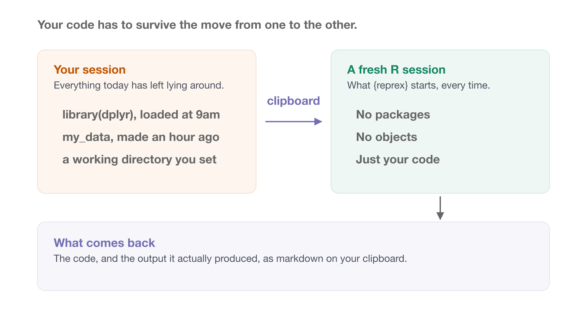
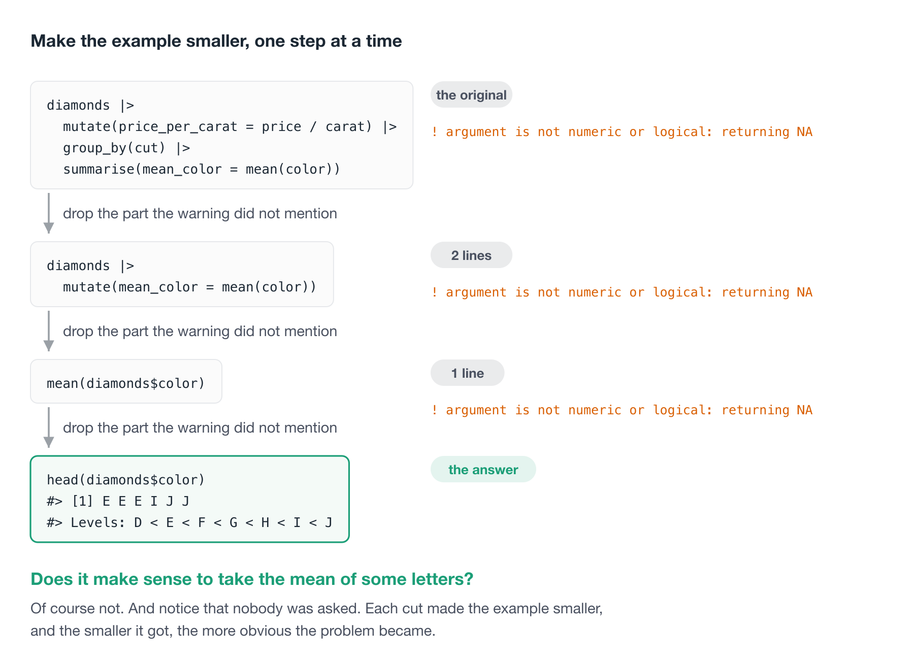
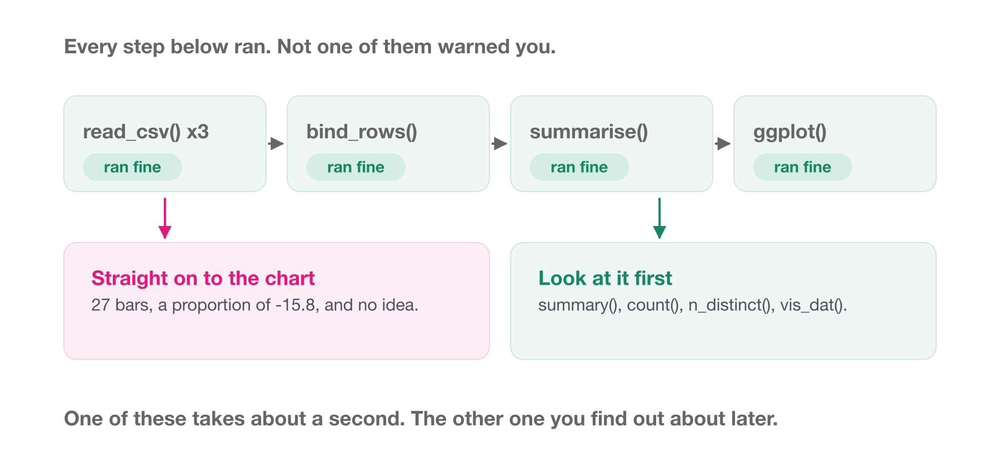

# Writing a reprex / getting unstuck

Everyone gets stuck. The skill isn't avoiding it, it's getting unstuck quickly, and being able to ask for help in a way that actually gets you an answer.

This section is about the **reprex**, which is short for **repr**oducible **ex**ample. We start with the smallest one there is, use it to share code that works perfectly well, and then turn it on code that doesn't. 

By learning to build a represx, you will will often solve the problem before you ask anybody else.

::: {.overview}

## Overview {.unnumbered}

**Duration** 45 minutes

**Questions**

- What is a reprex, and why would I want one?
- Does something have to be broken before a reprex is useful?
- How do I cut a broken script down to something someone else can run, and why does that so often solve it?
- How do I find a bug that never errors?
- Which errors am I going to hit over and over, and what do they mean?

:::

## What is a reprex?

A reprex is code, plus the output that code produced, in a form somebody else can run.

That is the whole idea. Here is one:

```{r}
mean(airquality$Ozone)
```

Hmmm, how can the mean be NA?

You can read what I ran, you can see what I got, and you can paste it into your own R session and get the same thing.

Now think about what happens without that.

You could send somebody just the code. But then they have to run it to see what you saw, and they have to guess which packages you had loaded.

You could send a screenshot of your console instead. Now they can see the output, but they can't run it, and they can't copy a line out of it to try something.

You could send both, by hand, every time. And now it's on you to make sure the code and the output actually match.

It gets worse with a plot. If the interesting thing is a chart, the code on its own doesn't show it, and the picture on its own can't be run.

So what you want is both, together, and correct. Which is fiddly to do by hand, and is why the package exists.

## Using {reprex}

You can do all of that by hand. You make sure the environment is clean, the right packages are loaded, the code is formatted, and any images come out at a sensible size.

If your problem is tightly defined that might take a couple of minutes.

Other times it takes far longer. Say, when you've got a variable sitting in your environment that you've forgotten how you created, and didn't realise was load-bearing. *OH GOD HOW DID I EVEN DO THIS.* Ahem.

So, after some sensible swearing, you might ask:

> Surely there is an easy, reproducible way to make reproducible examples?

There is: the [`{reprex}`](https://reprex.tidyverse.org/) package, by Jenny Bryan.

The workflow is four steps:

1. Copy your code to the clipboard.
2. Run `reprex()` and wait a moment for it to execute.
3. `{reprex}` shows you an HTML preview of the code *and its output*.
4. A markdown version is placed on your clipboard, ready to paste.

```r
reprex::reprex()
```

By default the output is formatted for GitHub, which is also what you want for Slack, email, or pasting into a message to a colleague.

{fig-alt="Two panels side by side. On the left, your session: everything today has left lying around, listing a package loaded at nine in the morning, an object made an hour ago, and a working directory you set. An arrow labelled clipboard leads right to a second panel, a fresh R session, which has no packages, no objects, and just your code. Below both, a band showing what comes back: the code and the output it actually produced, as markdown on your clipboard." width=100%}

::: {.callout-tip title="Why this actually works"}

`{reprex}` takes your copied code and runs `rmarkdown::render()` on it, **in a fresh R session**.

That's the whole trick. It means `{reprex}` will **fail hard and fail early** if your example isn't reproducible.

Try both of these. They work perfectly in your session, and neither survives a fresh one.

**Forgot a `library()` call.** Copy this and `reprex()` it:

```r
penguins |> count(species)
#> Error in count(penguins, species) : could not find function "count"
```

Obvious once you see it. Not obvious at all when you have had `{dplyr}` loaded since nine o'clock this morning.

**Relying on something you made an hour ago.** Make an object, then copy only the line that uses it:

```r
my_data <- penguins[penguins$species == "Gentoo", ]
```

```r
library(dplyr)

my_data |> count(species)
#> Error: object 'my_data' not found
```

Your session knows what `my_data` is. Nobody else's does, and neither does the fresh one `{reprex}` starts.

So when `reprex()` gives you a working example, you *know* it works. Not because you were careful, but because it was run somewhere your local mess doesn't exist.

:::

And it handles plots. If your example makes a chart, the chart comes out the other side along with the code that made it, which is the bit that was hardest to do by hand.

::: {.callout-note title="Your Turn"}

Start as small as it goes.

1. Copy these three lines to your clipboard:

```r
x <- c(1, 2, 3, NA)
mean(x)
```

2. Run `reprex::reprex()`.
3. Look at the preview. Then paste what landed on your clipboard into a fresh R script, and check it runs.

That's a reprex. Everything else in this chapter is that, on harder code.

:::

## A reprex isn't only for when things break

Almost everything written about reprexes is about asking for help with a bug. That is how I first learned about them, and it left me with the idea that a reprex is a thing you make when something has gone wrong.

It isn't. A reprex is just a small, runnable piece of code with its output attached, and there are plenty of reasons to want one of those.

**"Here's how I'd do it."** Someone asks how to count the rows in each group. You could describe `count()`. It's faster to show them:

```r
library(dplyr)

starwars |>
  count(species, sort = TRUE) |>
  head(3)
#> # A tibble: 3 × 2
#>   species     n
#>   <chr>   <int>
#> 1 Human      35
#> 2 Droid       6
#> 3 <NA>        4
```

**"Is there a nicer way to write this?"** Nothing is broken. You just suspect there is a neater version, and a reprex is how you ask without making somebody clone your project.

**"Look at this, it's great."** I send these constantly. A function I have just found, a bit of syntax I did not know about. Code with its output is how you show somebody something works.

**Notes to yourself.** I keep a file of these. Six months later, the code and its output together tell me what I worked out, and I don't have to run anything to remember.

The nice thing about starting here is that there is no pressure. Nothing is wrong, so there is nothing to diagnose. You are only practising the workflow.

::: {.callout-note title="Your Turn"}

1. Find something in your own recent code that works, and that you would be happy to show somebody. Three or four lines.
2. `reprex()` it.
3. Send it to the person next to you, and have them paste it into their R session. Does it run?

If it doesn't run on their machine, you have just learned something about your code that you did not know a minute ago.

:::

## Cutting a problem down

Now the harder use, and the one reprexes are famous for.

When you hit an error you cannot solve by tinkering, it is worth spending some time building a small example of the code that breaks.

This takes practice. But the thing I really like is:

**In the process of reducing the problem to its core, you'll often solve it yourself.**

It's the same experience as describing a problem out loud to a colleague and arriving at the answer before they've said anything.

So this isn't only a way to ask for help. It's a debugging technique that happens to produce something shareable.

Let's tear one down. Say we are summarising the `diamonds` data:

```r
library(tidyverse)

diamonds |>
  mutate(price_per_carat = price / carat) |>
  group_by(cut) |>
  summarise(
    price_mean = mean(price_per_carat),
    price_sd = sd(price_per_carat),
    mean_color = mean(color)
  )
#> Warning: There were 5 warnings in `summarise()`.
#> The first warning was:
#> ℹ In argument: `mean_color = mean(color)`.
#> ℹ In group 1: `cut = Fair`.
#> Caused by warning in `mean.default()`:
#> ! argument is not numeric or logical: returning NA
```

The warning gives us a clue: it is something about `mean_color`. So try just that:

```r
diamonds |>
  mutate(mean_color = mean(color))
#> Warning: There was 1 warning in `mutate()`.
#> ℹ In argument: `mean_color = mean(color)`.
#> Caused by warning in `mean.default()`:
#> ! argument is not numeric or logical: returning NA
```

Same warning, and we've dropped `group_by()` and `summarise()` entirely. Strip it further:

```r
mean(diamonds$color)
#> Warning in mean.default(diamonds$color): argument is not numeric or
#> logical: returning NA
#> [1] NA
```

Still the same. We are now down to one line. So what is in `color`?

```r
head(diamonds$color)
#> [1] E E E I J J
#> Levels: D < E < F < G < H < I < J
```

Ah. Does it make sense to take the mean of some letters? Of course not.

Notice what happened. We never needed to ask anyone.

Each step made the example smaller, and the smaller it got, the more obvious the problem became.

That's the technique.

{fig-alt="Four steps. An eight line pipeline warns that an argument is not numeric or logical. Dropping group_by and summarise gives the same warning from two lines. Dropping mutate gives the same warning from one line. Finally, looking at the column shows it is a factor, so taking its mean was never going to work. The answer arrived without anyone being asked." width=100%}

::: {.callout-note title="Your Turn"}

Here are two more that go wrong. Cut each one down the way we just did, one line at a time, until you can say what the problem is.

**One**

```r
library(tidyverse)

starwars |>
  filter(!is.na(species)) |>
  group_by(species) |>
  summarise(mean_hair = mean(hair_color))
```

**Two**

```r
library(tidyverse)

msleep |>
  group_by(vore) |>
  summarise(mean_rem = mean(sleep_rem))
```

For each one:

1. What is the smallest piece of code that still shows the problem?
2. Look at the column. What is actually in it?
3. Say the problem in one sentence.

The second one is the more interesting of the two, and it is worth noticing why: R never complains at all.

Then, once you have them cut down:

4. `reprex()` your reduced version of each. Does the preview show the warning?
5. Now break one on purpose. Delete the `library(tidyverse)` line from your clipboard and `reprex()` it again. What happens?

Step 5 is worth doing. `{reprex}` runs your code in a fresh session, so it finds the thing you forgot before your colleague does.

:::

## A bug with no error {#sec-silent-bug}

The `diamonds` example had a warning to follow. Most real bugs do not.

So let's do a harder one, on the script we have been working on all course.

### The setup

At the end of [Writing functions -@sec-writing-functions] we had `read_educated_population()`, which read a tidy spreadsheet.

Here is where that spreadsheet actually came from. Somebody sent over a folder of CSVs, one per year.

```r
library(tidyverse)

education_2014 <- read_csv("data/raw/raw_education_2014.csv")
education_2015 <- read_csv("data/raw/raw_education_2015.csv")
education_2016 <- read_csv("data/raw/raw_education_2016.csv")

education <- bind_rows(education_2014, education_2015, education_2016)
```

That runs without complaint, and gives you 216 rows across the three years.

Now the summary we came for. What proportion of people are studying, by age group?

```r
education |>
  group_by(age_group) |>
  summarise(prop_mean = mean(prop_studying))
#> # A tibble: 27 x 2
#>    age_group prop_mean
#>    <chr>         <dbl>
#>  1 15---19       0.813
#>  2 15--19      -15.8
#>  3 15-19         0.811
#>  4 20---24     -19.5
#>  5 20--24      -10.6
#>  6 20-24         0.406
#>  7 25---29      -9.73
#>  8 25--29      -14.0
#>  9 25-29         0.212
#> 10 30---34     -14.0
#> # i 17 more rows
```

Sit with that for a second, because there is a lot wrong and R said nothing at all.

There are **27 age groups**. There should be nine. And a *proportion* has come out as -15.8.

### Reducing it

Two things are wrong here, so find them one at a time, and start with the smaller of the two.

**How many age groups are there really?**

```r
n_distinct(education$age_group)
#> [1] 27

sort(unique(education$age_group))
#>  [1] "15---19" "15--19"  "15-19"   "20---24" "20--24"  "20-24"   "25---29"
#>  [8] "25--29"  "25-29"   "30---34" "30--34"  "30-34"   "35---39" "35--39"
#> [15] "35-39"   "40---44" "40--44"  "40-44"   "45---49" "45--49"  "45-49"
#> [22] "50---54" "50--54"  "50-54"   "55---74" "55--74"  "55-74"
```

There it is. `15-19` and `15--19` and `15---19` are the same age group typed three different ways, and `group_by()` has no way of knowing that. Nine real groups, spread across 27 spellings.

**Now the other one. Why is a proportion negative?**

```r
summary(education$prop_studying)
#>      Min.   1st Qu.    Median      Mean   3rd Qu.      Max.
#> -99.00000   0.04563   0.09626  -9.43312   0.20003   0.90308
```

A minimum of -99, in a column that can only sit between 0 and 1.

`-99` is a missing value code. Somebody, at some point, decided that missing should be written as -99 rather than left blank. `read_csv()` has no way of knowing that, so it read it as the number minus ninety-nine.

### The reprex

We are now down to two lines of it. Here is the whole thing, self-contained, with no data files and no packages beyond one:

```r
library(dplyr)

age_group <- c("15-19", "15--19", "15---19")
prop_studying <- c(0.81, -99, 0.84)

tibble(age_group, prop_studying) |>
  group_by(age_group) |>
  summarise(prop_mean = mean(prop_studying))
#> # A tibble: 3 × 2
#>   age_group prop_mean
#>   <chr>         <dbl>
#> 1 15---19        0.84
#> 2 15--19       -99
#> 3 15-19          0.81
```

Three rows of made up data, and both bugs are visible at once: one age group has become three, and a proportion is -99.

Three files and 216 rows, down to four lines somebody can run on their own machine in a second. That is the reduction, done on something real.

### Fixing it

Both fixes are one line, now that you can see what you are fixing.

The separators collapse with a regular expression that matches a *run* of anything that is not a digit:

```r
education |>
  mutate(age_group = str_replace_all(age_group, "[^0-9]+", "_"))
```

And the missing code becomes an actual missing value. [`{naniar}`](https://naniar.njtierney.com/) does this, and knowing what I know about that package's author, I would say it is a reasonable choice:

```r
library(naniar)

education |>
  replace_with_na(replace = list(prop_studying = -99))
```

Put the two together, and the summary finally says something sensible:

```r
education |>
  mutate(age_group = str_replace_all(age_group, "[^0-9]+", "_")) |>
  replace_with_na(replace = list(prop_studying = -99)) |>
  group_by(age_group) |>
  summarise(prop_mean = mean(prop_studying, na.rm = TRUE))
#> # A tibble: 9 x 2
#>   age_group prop_mean
#>   <chr>         <dbl>
#> 1 15_19        0.810
#> 2 20_24        0.407
#> 3 25_29        0.198
#> 4 30_34        0.131
#> 5 35_39        0.113
#> 6 40_44        0.0898
#> 7 45_49        0.0647
#> 8 50_54        0.0530
#> 9 55_74        0.0189
```

Nine groups, and every proportion sitting between 0 and 1.

{fig-alt="Four steps in a row, each ticked as having run without error or warning: read three CSVs, bind them into one table, summarise by age group, then plot. Below the chain, two outcomes. Straight on to the chart gives 27 bars, a proportion of minus 15.8, and no idea. Looking at it first, with summary, count, n_distinct or vis_dat, finds both problems in about a second. The steps are ticked green because every one of them really did succeed." width=100%}

::: {.callout-important title="This is the failure mode to be afraid of"}

Nothing errored. Nothing warned. Every step ran.

If you had gone straight from reading the files to a plot, you would have got a chart with 27 bars on it and probably assumed the data was just messier than you remembered. If you had gone to a model, you would have got coefficients.

The reason this got caught is that somebody looked at the intermediate object before using it. I would take that habit over any tool in this course.

`summary()`, `count()`, `n_distinct()`, and `visdat::vis_dat()` all take about a second, and any one of them would have found this.

:::

::: {.callout-note title="Your Turn: the other three years"}

You now have a fix that works on 2014 to 2016. Here is the rest of the folder.

The files live in the [ozed repo](https://github.com/njtierney/ozed), under `data/raw/`. There are six years in there, not three: 2014 to 2019.

1. Read in all six years, and run your fix over the lot.
2. Run `summary()` and `n_distinct()` again. Is it clean?
3. It is not. Work out what changed, and when. Looking at one year at a time is much faster than staring at all 480 rows.
4. Rewrite the fix so it works on all six years.
5. Where would you put that fix? In the script, or inside the function that reads the file? What is the argument for each?

Question 3 is the real exercise here. Whoever sent these files did not send you one problem.

::: {.callout-tip title="The answer, once you have had a go" collapse="true"}

| year | age separators | missing written as |
|------|----------------|--------------------|
| 2014 to 2016 | `-`, `--`, `---` | `-99` |
| 2017 | `;`, `:`, `::` | `-1` |
| 2018 | `.`, `..` | `9999` |
| 2019 | `\|`, `\|\|` | `Inf` |

The convention changed between years. A fix written by looking at 2014 will quietly not work on 2018, and nothing will tell you.

The separator fix survives it, because `[^0-9]+` never cared which character it was. The missing value fix does not, because `-99` is a specific number.

:::

:::

## Some known error patterns

Before you build a reprex, it is worth checking whether you have hit one of the handful of errors that everyone hits.

R's error messages have a reputation for being unhelpful. I think that reputation is only half deserved. A lot of them are perfectly clear once you have seen them once, and the trouble is that nobody sits you down and shows you the once.

So here are the ones I see most, in roughly the order you will meet them.

### `could not find function`

```r
starwars |> select(name, height)
#> Error in select(starwars, name, height) : could not find function "select"
```

This is the most common error in R, and it almost always means the same thing:

**You have not run `library()` yet.**

The function exists. It is sitting on your computer right now. R just has not been told to go and look in that package.

```r
library(dplyr)
starwars |> select(name, height)
```

It usually happens in one of three ways:

1. You restarted R, and forgot the `library()` calls are gone with the session.
2. You are running the script from the middle, and the `library()` calls are at the top.
3. You sent the code to someone else, and they don't have the same packages attached that you do.

That third one is why `{reprex}` runs your code in a fresh session. It catches this before your colleague does.

::: {.callout-tip title="A habit that removes this one entirely"}

Restart R and run your script from the top, often. `Cmd / Ctrl + Shift + F10` restarts R in both RStudio and Positron.

If it runs from a clean session, it will run on someone else's machine. If it only runs from *your* session, you have a dependency on something you cannot see, and you would much rather find that now than in a fortnight.

:::

### `there is no package called`

```r
library(dplyr)
#> Error in library(dplyr) : there is no package called 'dplyr'
```

Different error, and it is easy to confuse with the last one.

That one meant "installed, but not attached". This one means **not installed**.

```r
install.packages("dplyr")
```

The way to tell them apart: `could not find function` complains about a *function*, and `there is no package called` complains about a *package*.

### `object 'x' not found`

```r
mean(penguin_data$body_mass_g)
#> Error: object 'penguin_data' not found
```

R does not know about a thing by that name. Almost always one of:

- A typo. `penguin_data` and `penguins_data` are different names.
- You have not run the line that creates it yet.
- You restarted R, and it was only ever in your environment, never in the script.

The last one is worth dwelling on, because it is the reason for the blank slate settings back in [Project organisation -@sec-project-organisation]. If your script only works because of an object you made three days ago and never wrote down, your script does not work.

### `object of type 'closure' is not subsettable`

```r
mean$x
#> Error in mean$x : object of type 'closure' is not subsettable
```

This one is famous for being baffling, to the point that Jenny Bryan named [an entire keynote](https://www.youtube.com/watch?v=vgYS-F8opgE) after it.

Translated: **a closure is a function, and you tried to pull a column out of one.**

Nearly always you have a name collision with a function that already exists. Someone writes `df <- data.frame(...)`, then restarts R, then runs `df$x` before the line that makes `df`. There is a `df()` function in `{stats}`, so R finds *that*, and tells you you cannot subset it.

The fix is the fix for the error above: run the line that makes your object. The lesson is not to name your data after a function.

### `$ operator is invalid for atomic vectors`

```r
c(1, 2, 3)$a
#> Error in c(1, 2, 3)$a : $ operator is invalid for atomic vectors
```

You used `$` on something that has no columns. A plain vector has no names to reach for, so there is nothing for `$` to do.

Usually this means the thing you have is not the thing you thought you had. Check with `class()` before you check anything else.

### `cannot open file ... : No such file or directory`

```r
read.csv("data/penguins.csv")
#> Error in file(file, "rt") : cannot open file 'data/penguins.csv': No such file or directory
#> In addition: Warning message: cannot open file 'data/penguins.csv': No such file or directory
```

The file is not where you said it was, *relative to where R currently is*.

Two questions, in this order:

```r
getwd()          # where does R think it is?
fs::dir_ls()     # what can it actually see from there?
```

Nine times in ten the answer is that your working directory is not the project root, which is the entire argument for projects and `here()` in [Project organisation -@sec-project-organisation].

### `unexpected symbol`, `unexpected ')'`, `unexpected end of input`

```r
mean(c(1, 2)
#> Error in parse(text = ...) : <text>:2:0: unexpected end of input
#> 1: mean(c(1,2)
#>    ^
```

These are the ones where R could not even read your code, let alone run it. A bracket, a quote or a comma is missing.

The useful trick is that **the caret points at where R gave up, not at where you went wrong**. The mistake is usually a line or two *above* the mark.

Two things that make these mostly go away:

- Turn on rainbow parentheses, which we set up in [Project organisation -@sec-project-organisation]. A missing bracket becomes a colour you can see.
- Run `air format .`. A formatter cannot format code it cannot parse, so it will land you on the broken line straight away.

### The one with no error at all

The worst pattern in this list produces no message.

Two attached packages both export a function called `lag()`, R hands you the one from whichever package you attached last, and you get a column of plausible looking numbers that are wrong.

That one gets a section of its own in [When two packages collide](writing-readable-code.qmd#sec-conflicted), along with the one-line fix.

::: {.callout-note title="Your Turn"}

1. Restart R, then run the second half of a script you are working on. Which of the errors above did you get first?
2. Reading the message alone, could you say which of the two "missing" errors it is: not installed, or not attached?
3. Fix it by adding to the top of the script rather than by typing into the console. What is the difference between those two fixes?

:::

## Practical tips on debugging

::: {.callout-note title="Your Turn"}

1. TODO: exercise for this section.

:::

### Keep solving vs cleaning up

::: {.callout-tip title="Read more"}

Parts of this chapter are adapted from my blog posts [How to get good with R](https://www.njtierney.com/posts/2023-10-30-how-to-get-good-with-r/) and [Magic reprex](https://www.njtierney.com/posts/2019-01-11-magic-reprex/), the latter of which has gifs of the whole workflow in action.

:::
