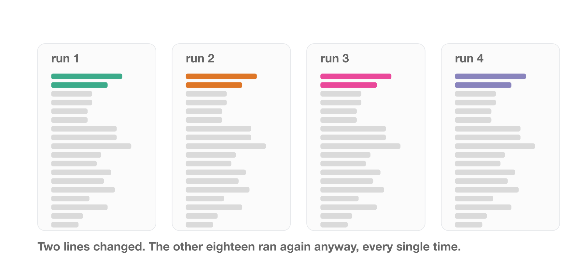
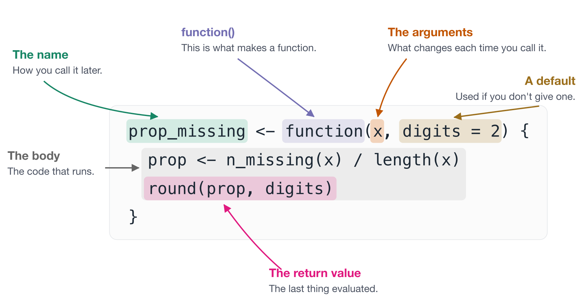
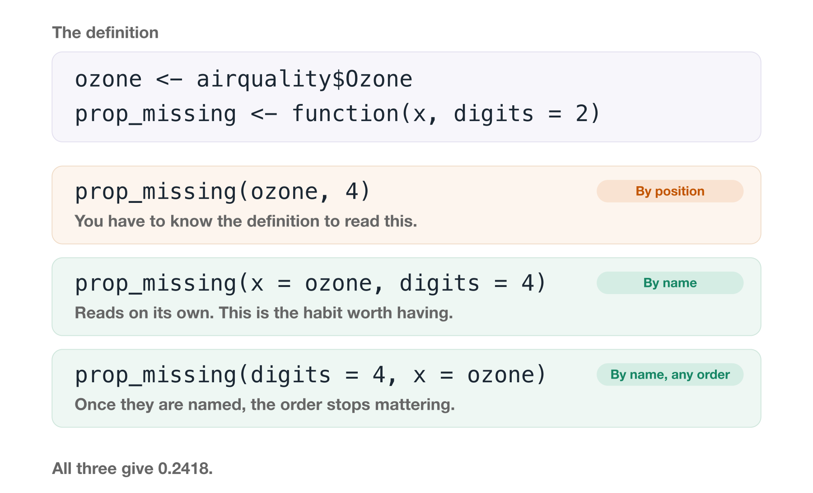

# Writing functions {#sec-writing-functions}

> "You should consider writing a function whenever you've copied and pasted a block of code more than twice."
>
> -- Hadley Wickham, Mine Çetinkaya-Rundel and Garrett Grolemund, [R for Data Science](https://r4ds.hadley.nz/functions.html)

At some point you notice you have written code that looks something like the following:

```{r}
#| output: false
#| echo: false
library(dplyr)
```

```{r}
library(dplyr)
adelie_mean <- penguins |>
  filter(species == "Adelie") |>
  pull(body_mass) |>
  mean(na.rm = TRUE)
gentoo_mean <- penguins |>
  filter(species == "Gentoo") |>
  pull(body_mass) |>
  mean(na.rm = TRUE)
chinstrap_mean <- penguins |>
  filter(species == "Chinstrap") |>
  pull(body_mass) |>
  mean(na.rm = TRUE)
```

The issue with this is that you are repeating the same code three times, but changing only one part. In this case, only one part is changing:

```{r}
#| eval: false
filter(species == "Adelie")
filter(species == "Gentoo")
filter(species == "Chinstrap") 
```

We can express this idea more clearly with a function, comparing the result above the function:

```{r}
species_body_mass_mean <- function(species_name){
  penguins |> 
    filter(species == species_name) |> 
    pull(body_mass) |> 
    mean(na.rm = TRUE)
}
adelie_mean
species_body_mass_mean("Adelie")

gentoo_mean
species_body_mass_mean("Gentoo")

chinstrap_mean
species_body_mass_mean("Chinstrap")
```

In this chapter we discuss how to notice these moments of repition, and how to convert these into functions, so you can clearly express your ideas. We will also work through how to get inside a function when it misbehaves.

::: {.overview}

## Overview {.unnumbered}

**Duration** 60 minutes

**Questions**

- What problem do functions actually solve?
- What are the parts of a function called, and why does that matter?
- What should I call a function, and what should I call its arguments?
- How do I look inside a function when it goes wrong?

:::

## The problem functions solve

I do not think I can overstate this: learning to write functions changed how I think about code, and how I think about solving problems. It does take time to develop, but the payoff is enormous.

A function isn't only a way to avoid typing something twice. It's a way to take complexity and express it in ways that you can reason with.

Once you can do that, you can hold a bigger problem in your head. It's like when you know a new word for a concept:

> Benighted: Unexpectedly caught out in the dark

> Scrumping: To steal fruit such as apples from trees

My journey into functions started in 2013. I was writing code to calculate a t-test from scratch. I had my reasons! At the top of my script was something like:

```r
var_1 <- data$x1
var_2 <- data$x2
```

and then a pile of code that computed the result.

::: {.callout-tip title="The whole script, if you want to see it" collapse="true"}

This is roughly what the code looked like. What I want you to notice is how much of it there is, and where the two lines I kept editing are.

```r
var_1 <- data$x1                                              # <1>
var_2 <- data$x2                                              # <1>

n_1 <- length(var_1)
n_2 <- length(var_2)

mean_1 <- mean(var_1)
mean_2 <- mean(var_2)

var_within_1 <- sum((var_1 - mean_1)^2) / (n_1 - 1)
var_within_2 <- sum((var_2 - mean_2)^2) / (n_2 - 1)

pooled_var <- ((n_1 - 1) * var_within_1 + (n_2 - 1) * var_within_2) / (n_1 + n_2 - 2)
std_error <- sqrt(pooled_var * (1 / n_1 + 1 / n_2))

t_statistic <- (mean_1 - mean_2) / std_error
degrees_freedom <- n_1 + n_2 - 2
p_value <- 2 * pt(-abs(t_statistic), df = degrees_freedom)

t_statistic
p_value
```

1. These two lines are the only part that ever changed.

:::

Every time I wanted to look at a different pair of variables, I went back to the top, changed those two lines, and ran the whole script again.

Two lines out of twenty changed - and I re-ran all of them, by hand, every single time. Something felt off to me!

{fig-alt="Four copies of the same script side by side, drawn as rows of grey bars rather than readable code. In every copy the top two rows are coloured, a different colour in each copy, and the remaining eighteen rows are identical grey. A label underneath reads: two lines changed, the other eighteen ran again anyway, every single time." width=100%}

Something about this felt wrong at the time. But I didn't have the words for it.

What I was reaching for sounded something like:

> I want to run this script, but get the top couple of lines to change depending on which variables I specify.

What I needed was a function, but I just didn't have the words for it.

I had been **taught** functions by then. And I had been **using** functions the whole time, things like `lm()`, `table()`, `subset()`, and `read.csv()`. I used them every day without ever thinking about where they came from, or that I could make my own.

But the examples I was taught with were "convert Celsius to Fahrenheit" and "identify odd numbers", and I couldn't see how those applied to anything I actually did.

They seemed like useful kitchen trinkets. An apple corer, a garlic press. Rather than a fundamental skill, like knowing how to use a knife.

Functions are the knife.

So rather than argue that, let me show you.

What does this code do?

We'll use `penguins`

```{r}
head(penguins)
```

```{r}
bill_len <- penguins$bill_len
bill_dep <- penguins$bill_dep

bill_len_0 <- (bill_len - mean(bill_len, na.rm = TRUE)) / sd(bill_len, na.rm = TRUE)
bill_dep_0 <- (bill_dep - mean(bill_dep, na.rm = TRUE)) / sd(bill_len, na.rm = TRUE)
```

Before you read on, have a proper go at this one.

::: {.callout-note title="Your Turn"}

Here is the code again. Don't run it.

```r
bill_len <- penguins$bill_len
bill_dep <- penguins$bill_dep

bill_len_0 <- (bill_len - mean(bill_len, na.rm = TRUE)) / sd(bill_len, na.rm = TRUE)
bill_dep_0 <- (bill_dep - mean(bill_dep, na.rm = TRUE)) / sd(bill_len, na.rm = TRUE)
```

1. In one sentence, what is this code doing?
2. There is a bug in it. Find it.
3. How long did that take you, and what made it hard?

:::

So, what is it doing?

This is mean centering and scaling. It's a transformation that gives your data a mean of 0 and a standard deviation of 1, which some statistical models want.

But reading that code, it's hard to see that's what's happening. Nothing in it says "centre and scale". You have to reconstruct the intent from the arithmetic.

Worse, it invites errors, because you have to repeat `bill_len` or `bill_dep` three times per line.

And there **is** an error.

Look at the second line again. For `bill_dep_0`, I divide by the standard deviation of **`bill_len`**, not `bill_dep`.

That's a copy-paste bug, it's completely silent, and it produces numbers that look entirely plausible. If you found it, well done. If you didn't, that is why I would rather not rely on either of us spotting it.

A function fixes this by **abstracting away** the need to write the variable in each time. Break it into two steps:

```r
mean_center <- function(variable) {
  variable - mean(variable, na.rm = TRUE)
}

scale_sd <- function(variable) {
  variable / sd(variable, na.rm = TRUE)
}
```

Now we can write:

```r
bill_len |>
  mean_center() |>
  scale_sd()
```

Or write one function that does both steps:

```r
center_scale <- function(variable) {
  centered <- mean_center(variable)
  centered_scaled <- scale_sd(centered)
  centered_scaled
}
```

What is nice here is that each function **describes what it does** in its name. Reading `center_scale`, you can see it does a thing called `mean_center` first, then `scale_sd` next.

So compare the original:

```r
bill_len_0 <- (bill_len - mean(bill_len, na.rm = TRUE)) / sd(bill_len, na.rm = TRUE)
bill_dep_0 <- (bill_dep - mean(bill_dep, na.rm = TRUE)) / sd(bill_len, na.rm = TRUE)
```

with:

```r
bill_len_0 <- center_scale(bill_len)
bill_dep_0 <- center_scale(bill_dep)
```

Now you can't even write the bug, the function has removed that possibility, by clearly expressing the problem.

::: {.callout-tip title="Someone has probably done this already"}

Base R has `scale()`. Its help page describes it as centring and scaling the columns of a numeric matrix, which is the two steps we just wrote, in one call.

```r
head(center_scale(bill_len), 3)
#> [1] -0.8832047 -0.8099390 -0.6634077

head(scale(bill_len), 3)
#>            [,1]
#> [1,] -0.8832047
#> [2,] -0.8099390
#> [3,] -0.6634077
```

Same numbers. The only difference is that `scale()` hands back a matrix, because it is built to do every column of one at a time.

Which is a good argument for checking whether a solution exists before writing your own. You don't need to write everything from scratch.

At worst you find nobody has solved your problem, which is an opportunity. Usually you learn the words other people use to describe it, which makes your next search much better.

:::

## Anatomy of a function

Every function in R has the same few parts. 

The reason to learn the names is practical. For example, knowing a term like a "default argument", means you can search for it, read the help page about it, and ask someone a question that gets you a useful answer. Without the words, you are stuck describing the shape of the problem and hoping.

We'll use two small functions here. The first counts how many values are missing:

```{r}
n_missing <- function(x) {
  sum(is.na(x))
}

n_missing(airquality$Ozone)
```

The second uses that one to work out what **proportion** is missing:

```{r}
prop_missing <- function(x, digits = 2) {
  prop <- n_missing(x) / length(x)
  round(prop, digits)
}

prop_missing(airquality$Ozone)
```

Notice `prop_missing()` calls `n_missing()`. You write a small function that does one thing, and then you use it inside the next one, instead of writing `sum(is.na(x))` again and hoping you type it the same way.

{fig-alt="The function prop_missing defined with function(x, digits = 2), with six parts highlighted in colour: the name, the function keyword, the argument x, the default digits = 2, the body, and the return value." width=100%}

Taking the parts one at a time:

- **The name.** `prop_missing`. This is how you call it later, so it is worth spending time to pick a good one. More on that just below.
- **`function()`.** This creates a function. `prop_missing <-` just gives it a name, the same way you would bind any other value.
- **The arguments.** `x` and `digits`. These are the what change each time you call the function. They are the answer to "what did I keep editing at the top of my script?"
- **A default.** `digits = 2`. If the caller doesn't supply `digits`, it is 2. Defaults let you make a function easy to call in the common case, without giving up control in the uncommon one.
- **The body.** Everything between the braces. This is the code that runs.
- **The return value.** R returns the **last thing evaluated**, so here that's the rounded proportion. You can write `return()` explicitly, and sometimes should for an early exit, but you don't have to.

### Naming a function

We spent a whole chapter on naming variables, and functions get the same treatment. The difference is that a function **does** something, so the name should say what.

Watch this one improve:

```r
myfun()                    # what?
temperature_conversion()   # better, but converting what to what?
celcius_to_fahrenheit()    # now I don't have to read the body
```

The pattern that gets you there is **`input_to_output()`**. Not every function fits it, but reaching for it is a fast way to find out whether you actually know what your function does. If you can't fill in both halves, that is worth knowing before you write the body.

The same care goes inside. Name the arguments and the intermediate values to match:

```r
celcius_to_fahrenheit <- function(celcius) {
  fahrenheit <- (celcius * 9 / 5) + 32
  fahrenheit
}
```

Read that and there is nothing left to work out. The argument says what goes in, the intermediate says what comes out, and the name says what happened in between.

### Arguments, and where their values come from

The arguments are the part that trips people up, because `x` and `digits` do not have values when you write the definition. They are names waiting for something. The values arrive when you call the function, and where they arrive is decided by the order you write them in:

{fig-alt="Three panels. The first shows the definition prop_missing <- function(x, digits = 2), with x highlighted in orange and digits = 2 in brown. The second shows the call prop_missing(airquality$Ozone), with airquality$Ozone underlined in orange and labelled 'becomes x', a badge noting that digits falls back to 2, and the result 0.24. The third shows prop_missing(airquality$Ozone, digits = 4), with airquality$Ozone labelled 'becomes x' and digits = 4 labelled 'becomes digits', returning 0.2418." width=100%}

The same function, two different answers, and nothing about the function changed. That is the whole job of an argument.

You can hand the values over in two ways. **By position**, in the order the definition lists them, or **by name**, using `name = value`.

{fig-alt="A function definition, prop_missing with arguments x and digits equals two, shown at the top along with ozone being assigned from airquality dollar Ozone. Below it three calls, all returning the same answer. The first passes both values by position and is marked by position, with the note that you have to know the definition to read it. The second names both arguments and is marked by name, the habit worth having. The third names both but puts them in the opposite order, and is marked by name any order, because naming makes order irrelevant." width=100%}

All three give the same answer. The difference is what you have to already know in order to read the line.

**Name your arguments where you can.** `prop_missing(ozone, 4)` requires you to remember what the second slot is for. `prop_missing(x = ozone, digits = 4)` tells you. The first argument is usually obvious enough to leave positional, and everything after it is worth naming.

::: {.callout-note title="Your Turn"}

Here is a function. Don't run it, and don't worry about what it computes.

```r
rate_per_1000 <- function(count, population, digits = 1) {
  rate <- (count / population) * 1000
  round(rate, digits)
}
```

Name the parts:

1. What is the **name** of this function?
2. What are its **arguments**?
3. Which argument has a **default**, and what is it?
4. What is the **body**?
5. What does it **return**?
6. Now call it two ways: once letting `digits` take its default, and once setting it yourself.

This one is really about the vocabulary. Once you can say "the third argument has a default", you can look it up and you can ask about it.

:::

::: {.callout-tip title="Two more parts, once the above is comfortable" collapse="true"}

These are worth knowing about eventually. Skip them for now if you are still getting the hang of the parts above.

**Side effects.** Anything a function does **other** than return a value:

- Printing to the console (`summary(lm_fit)`)
- Writing a file (e.g., a CSV, .rds, .png)
- Drawing a plot (e.g., `ggplot(...)` or `plot(...)`)
- Setting an option. 

Side effects are not bad. Plenty of useful functions have them.

But the issue is with reasoning - if a function returns something useful (a value) **and** quietly writes a file, it is harder to reason about than one that does a single one of those things.

**Functions are values.** An argument can be a function. Here is the situation where you would want that.

Say you want to know how many values are missing in each column of your data. With the function we already have, you could write:

```r
n_missing(airquality$Ozone)
n_missing(airquality$Solar.R)
n_missing(airquality$Wind)
n_missing(airquality$Temp)
n_missing(airquality$Month)
n_missing(airquality$Day)
```

That is six lines to say one thing. You have to know every column name, you have to type each one correctly, and when the data gains a column next month you have to remember to come back and add a line.

It is the copy-paste problem from the start of this chapter, wearing a different hat.

What you want to say is "do this to every column". To say that, you need to hand one function to another function:

```{r}
library(purrr)

map_int(airquality, n_missing)
```

Look closely at how `n_missing` is written there. **No brackets.** We are not calling it, we are handing it over, the same way we would hand over a number or a data frame. That is what "functions are values" means.

And you can accept a function in your own functions too:

```{r}
n_complete <- function(x) {
  sum(!is.na(x))
}

summarise_columns <- function(data, f) {
  map_dbl(data, f)
}

summarise_columns(airquality, n_complete)
```

::: {.callout-tip title="A quick word on `map()`"}

[`purrr`](https://purrr.tidyverse.org/) is the tidyverse package for applying a function to each element of something. The suffix tells you what comes back: `map()` gives a **list**, `map_int()` an **integer vector**, `map_dbl()` a **double vector**, and so on.

The typed ones error if the function cannot deliver that shape, which is the useful half. You say what you are expecting, and you find out straight away rather than three lines later.

Base R has its own versions, called `lapply()`, `vapply()` and `sapply()`.

Handing over a function you will only use once, without naming it, is worth knowing about too. That is in [Anonymous functions -@sec-anonymous-functions].

:::

:::

## Other things worth turning into a function

Here are a few more ideas that you might turn into a function.

**A calculation you keep redoing.** Body mass index, a rate per thousand, a unit conversion.

```{r}
bmi <- function(weight_kg, height_m) {
  weight_kg / height_m^2
}
```

The function helps you know the units are right. The argument names do it for you.

```{r}
bmi(weight_kg = 70, height_m = 1.75)
```

Unit conversions are the same idea:

`penguins` records body mass in grams, we can state `input_to_output()`:

```{r}
grams_to_kg <- function(grams) {
  grams / 1000
}
library(dplyr)
penguins |> 
  mutate(body_mass_kg = grams_to_kg(body_mass),
         .after = body_mass) |> 
  head()

```

- Also note that nice `.after` argument of `mutate()`

**A check you want to run on every dataset that comes in.** We built one of these a moment ago: `n_missing()`, in [Anatomy of a function](#anatomy-of-a-function).

It's OK if the function is three lines long and doing something boring, or something repetitive. If they help express an idea more clearly, it is worth it.

::: {.callout-tip title="Small functions add up" collapse="true"}

Here is one more of the same kind, to go with the two we already have:

```{r}
n_complete <- function(x) {
  sum(!is.na(x))
}

n_complete(airquality$Ozone)
```

A couple of things to notice across these.

- `prop_missing()` **calls** `n_missing()` rather than writing `sum(is.na(x))` out a second time. Fix a bug in one, and you have fixed both.

- They are **named for the question they answer**, not for how they answer it. `prop_missing()`, not `round_na_ratio()`.

We come back to `prop_missing()` soon.

:::


::: {.callout-note title="Your Turn"}

Look at your most recent analysis script.

1. Find a chunk of code you have written more than once, with something small changed each time
2. Write down, in one sentence, what that chunk is **for**.
3. That sentence is the name of the function - the idea. Don't write it yet, just note it down.

:::

## How to use a debugger

R is interactive. You run some code, you see the output immediately, and when something goes wrong you can poke around and look at it. R was designed as an interactive language - and this is distinct and different to scripted languages like C, C++, and Rust. The interactivity it special, and makes doing data analysis interactive. It is good.

Functions break that interactivity a little bit. A function is a box - you put code in, and return an output. By default you can't see inside a function while it runs.

For example, give `prop_missing()` an intermediate value on its way to the answer:

```{r}
prop_missing <- function(x, digits = 2) {
  prop <- n_missing(x) / length(x)
  round(prop, digits)
}

prop_missing(airquality$Ozone)
```

We cannot look at `prop`:

```{r}
prop
```

We know it existed! The function could not have given you an answer without it. But it lived inside the box, for a moment, and there is no way to reach it from out here.

We are used to interactively checking through code, but you can't print it, you can't `View()` it, you can't check its class.

To look inside, you need a special thing called a "debugger".

::: {.callout-caution title="A confession"}

If you have ever copied a function into a new script, commented out function definition, then hard-coded the arguments at the top:

```{r}
# prop_missing <- function(x, digits = 2) {
n_missing <- function(x) sum(is.na(x))

x <- airquality$Ozone
digits <- 2
prop <-  n_missing(x) / length(x)

round(prop, digits)
# }
# prop_missing(airquality$Ozone)
```

And run it line by line - this section is for you.

I say that as someone who did that for years.

:::

### A good case for a debugger

Small functions do not need one. `mean_center()` is two lines, and you can read it.

It gets harder the moment functions call other functions. Here is `prop_missing()` from earlier in the chapter:

```{r}
n_missing <- function(x) {
  sum(is.na(x))
}

prop_missing <- function(x, digits = 2) {
  prop <- n_missing(x) / length(x)
  round(prop, digits)
}
```

When `prop_missing()` gives you a number you don't believe, the problem could be in either function, and `x` inside `n_missing()` is not an object you can look at. It exists for a moment, in the middle of a call you did not make directly, and then it is gone.

### Debugging with `browser()`

Let's give ourselves something to find. Here is `prop_missing()` again:

```{r}
n_missing <- function(x) {
  sum(is.na(x))
}

prop_missing <- function(x, digits = 2) {
  prop <- n_missing(x) / length(x)
  round(prop, digits)
}

prop_missing(airquality$Ozone)
prop_missing(airquality)
```

It runs. Nothing errors, for `airquality$Ozone` it looks right, but then for `airquality` you get a proportion of `r prop_missing(airquality)`. That's stange. And wrong.

Let's go and look.

**`browser()` is like a stop sign that you put inside a function.** 

You write it on the line you want to stop at:

```r
prop_missing <- function(x, digits = 2) {
  prop <- n_missing(x) / length(x)
  browser()
  round(prop, digits)
}
```

Now call the function the way you normally would:

```r
prop_missing(airquality)
#> Called from: prop_missing(airquality)
#> Browse[1]>
```

That `Browse[1]>` is an R console, and it is standing **inside** the function. Every argument is now a real object you can look at, so look at the two numbers going into the division:

```r
Browse[1]> length(x)
#> [1] 6

Browse[1]> n_missing(x)
#> [1] 44
```

There it is! `length(x)` gives us 6. Because length(data.frame()) returns the number of columns, not the number of elements.

We we divided 44 by 6 instead of the number of elements - rows x cols. A proportion has to divide by everything.

That didn't take too much work! Just a few questions.

The trick is a little bit more complex - and I think I'd like you to have a go at solving this in the next exercise.

A few commands are worth knowing at that prompt of `browser()`:

| type this | and it does |
|-----------|-------------|
| `n` | run the next line |
| `c` | continue until the function ends |
| `Q` | quit, and go back to your console |
| `help` | print the list of these commands |
| anything else | evaluated as ordinary R, in the function's environment |

That last row is the one that matters. Anything you would normally type at the console works here, which means you already know how to use a debugger. You just have to get inside one.

**The catch with `browser()` is that it is committed code.** It stops your script, and it will stop it for whoever runs it next, so you have to remember to take it out again.

::: {.callout-note title="We do this one live"}

Reading about a debugger is close to useless. This is a demonstration in the session - I will put us inside a function, and we will poke at it together.

If you are reading this on your own afterwards, run the Your Turn below rather than just reading it. The whole skill is in the doing.

:::

::: {.callout-tip title="Without editing the function: debugonce(), debug() and undebug()" collapse="true"}

Editing a function to add `browser()`, saving, sourcing, and then remembering to take it out again is a lot of steps. There is a way to do the same thing from the console.

**`debugonce()`** says: next time this function runs, stop at the first line. Once only, so there is nothing to undo.

```r
debugonce(prop_missing)

prop_missing(airquality)
#> debugging in: prop_missing(airquality)
#> Browse[1]>
```

Same prompt, same commands, no edit to the function and nothing left behind.

**`debug()` and `undebug()`** are the version that stays on. `debug()` marks the function, and it stays marked until you call `undebug()`.

```r
debug(prop_missing)
undebug(prop_missing)
```

That is occasionally what you want, when you are stepping through the same function over and over. Mostly it is not. I've forgotten to call `undebug()` and felt a genuine madness descend as every subsequent call dropped me into the debugger.

So of the two, reach for `debugonce()`.

:::


::: {.callout-note title="Your Turn"}

I want you to write n_missing(), n_complete(), and prop_complete(), so that they all work on a column, or a data.frame. Here's some starting code:

```{r}
n_missing <- function(x) {
  sum(is.na(x))
}

n_complete <- function(x) {
  sum(!is.na(x))
}

prop_missing <- function(x, digits = 2) {
  prop <- n_missing(x) / length(x)
  round(prop, digits)
}
```

1. Start by using `browser()` inside prop_missing - play around inside it.
2. Now run `debugonce(prop_complete)`, then call it again. You will land inside the function.
3. Ask it questions - how can you get the number of elements? Are there existing functions inside of R you can use to get the total elements?
4. Type `Q` to quit, fix the function, and run it again. You should get `0.76`.
5. Do it once more, and this time step through with `n` rather than quitting.

Then do the same on a function of your own that you don't entirely trust.

The habit worth building: when a function surprises you, your first move is `debugonce()`, not copying the body into a new script.

:::

::: {.callout-tip title="Read more"}

Parts of this chapter are adapted from my blog post, [How to get good with R](https://www.njtierney.com/posts/2023-10-30-how-to-get-good-with-r/).

The function design walkthrough, and the argument that DRY treats the symptom rather than the cause, come from my talk **Practical functions: practically magic** - [slides](https://njtierney.github.io/funfun/#/title-slide) and [source](https://github.com/njtierney/funfun).

Its take-home messages are worth repeating here. Good functions:

1. Manage **complexity**
2. Explain and express **ideas**
3. Can be **individually reasoned** with
4. Take **iteration**

:::

## Where this script goes next

We chunked a hundred line script back in [Writing readable code](writing-readable-code.qmd#sec-de-chunking), and left it with six comments in it, one per idea.

Once each of those ideas is a function with a name, the whole script is this:

```r
source("packages.R")
lapply(list.files("./R", full.names = TRUE), source)

educated_population_2014 <- read_educated_population(year = "2014")

ggplot(educated_population_2014, aes(x = prop_studying, y = state_territory)) +
  geom_col() +
  facet_wrap(~age_group)
```

Ninety lines to six. The other eighty-four did not disappear. They moved into `R/`, one file per function, exactly the layout from [Project organisation -@sec-project-organisation].

Getting there is a whole chapter of its own, and it is [Designing functions -@sec-designing-functions]. That is where we take this script apart a chunk at a time, and where the two identical steps become one function called twice.

## Summary {.unnumbered}

1. Functions are managing complexity so you can reason with it.
2. Name a function for what it does, not how it does it. `celcius_to_fahrenheit()`, not `myfun()`.
3. The parts that change between uses are the arguments. The parts that don't change are often defaults.
4. Small functions build on each other. `prop_missing()` calls `n_missing()` rather than repeating it.
5. When a function surprises you, look inside it with `browser()` or `debugonce()`.

If you remember nothing else from this chapter, remember this: **Functions are managing complexity so you can reason with it.**
