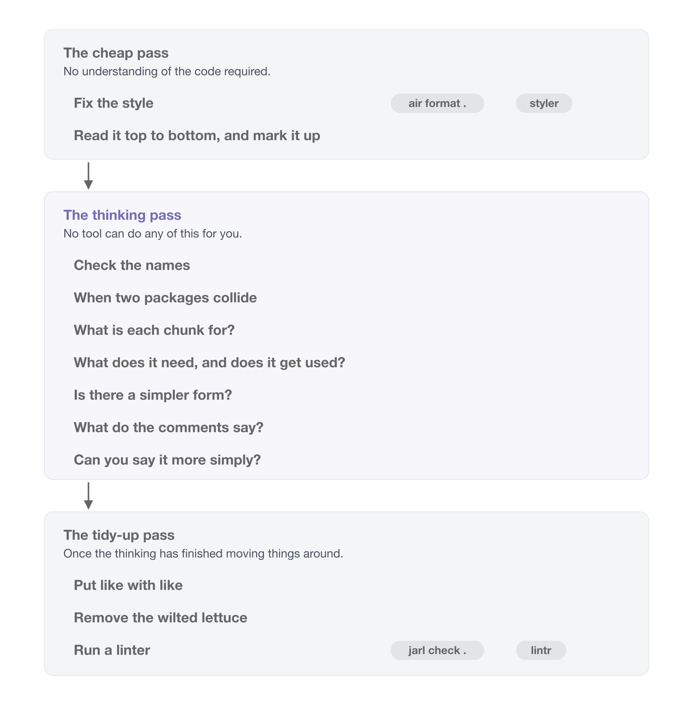
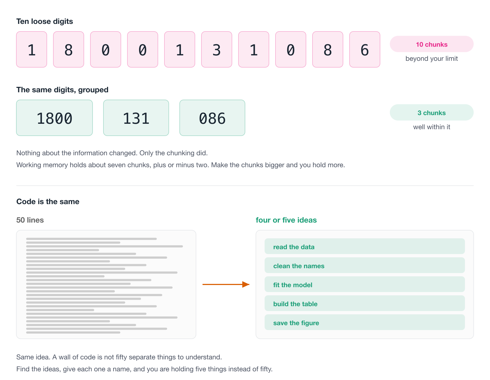

# Writing readable code {#sec-writing-readable-code}

> "Programs must be written for people to read, and only incidentally for machines to execute."
>
> -- Harold Abelson and Gerald Jay Sussman, [Structure and Interpretation of Computer Programs](https://mitp-content-server.mit.edu/books/content/sectbyfn/books_pres_0/6515/sicp.zip/index.html)

So far we have focussed on structural things I would class as "easy wins":

- File paths
- Reproducibility fixes
- Quality of life improvements to your editor
- Creating projects
- Project structure (Adding a README!)
- Automatic styling
- Automatic linting

I really appreciate is how tools like {air}/{styler} and {jarl}/{flir} make this easy and repeatable.

Now let's talk about something that is a bit more of a skill that can't be automated: how to write readable code. 

We will work on one script and discuss it, and some principles on good coding.

::: {.overview}

## Overview {.unnumbered}

**Duration** 90 minutes

**Questions**

<!-- These map onto the sections below, in order. If you move a section, move its question. -->

- Why go back over code you have already written?
- What are the three passes of a review, and which of them can a machine do?
- What makes a variable name good enough?
- What happens when two packages have a function with the same name?
- How do I break a wall of code into readable pieces?
- Can I say what this code is for, and can I say it more simply?
- How do I review someone else's code without it going badly?

:::

## Clean as you go

There are two core ideas I'd like to get across this chapter:

> "Programs must be written for people to read, and only incidentally for machines to execute."
>
> -- Harold Abelson and Gerald Jay Sussman, [Structure and Interpretation of Computer Programs](https://mitp-content-server.mit.edu/books/content/sectbyfn/books_pres_0/6515/sicp.zip/index.html)

Your code is only incidentally for computers - so we want it to be well written for us to understand, and protect our mental cycles!

The other idea is:

> You won't write your best code on the first pass.

Just like writing, I don't write my best code on the first pass. Your code gets better as you review it. The first time around you write code, is for getting it working, mostly. After that, you are improving readability, and expression.

To add another analogy into the mix: Professional kitchens clean as they go, because a tidy bench keeps your mind clear and because the alternative is chaos by service. 

So a best practice to add to your learning is: when you finish a piece of code, go back over it briefly. That review is **three passes**, and we spend most of this chapter on them:

1. **The cheap pass.** Fix the style, then read it top to bottom and mark up anything that catches you. Neither move asks you to understand the code.
2. **The thinking pass.** Check the names, work out what each chunk is for, and ask whether there is a simpler way to say the same thing. No tool helps you here.
3. **The tidy-up pass.** Put like with like, throw out the code you commented out and never came back to, and run a linter over everything you moved.

The order matters, and the reason is in the middle one. The thinking pass moves code around, so the tidying and the linting have to come after it, not before.

{fig-alt="Three stacked bands, one per pass. The top grey band is the cheap pass, which needs no understanding of the code: fix the style, with pills for air format and styler, and read it top to bottom and mark it up. An arrow leads down to a much taller purple band, the thinking pass, which is yours alone: check the names, when two packages collide, what is each chunk for, what does it need and does it get used, is there a simpler form, what do the comments say, and can you say it more simply. A second arrow leads down to a final grey band, the tidy-up pass, done once the thinking has moved things around: put like with like, remove the wilted lettuce, and run a linter, with pills for jarl check and lintr. The middle band is by far the largest because that is where the work is." width=100%}

Now, you can't do a full review of your code, all the time.

But **doing some of it** will make your code better - and you'll get faster at it the more you practice.

Let's talk through these review practices by reviewing an example script.

## The script {#sec-the-script}

Imagine that someone hands you a script. It runs, it makes a plot at the end, and they would like another year of data added to it. Today, ideally. 

Here's the script! Don't read it closely yet. Scroll through it. What do you notice?

```r
library(readxl)
library(janitor)

# Read in the raw data
data <- read_excel(
  path = "data/Education and work, 2023, Datacube 2 (Table 11).xlsx",
  sheet = "2014",
  skip = 4,
  n_max = 32,
  # use janitor::make_clean_names to turn `15-19 years` to "x15_19_years"
  .name_repair = make_clean_names
)

# sum(is.na(data))
# nrow(data)

# clean up the silly names from excel
names(data)
the_names <- names(data)
the_names[1] <- "state_territory"
the_names2 <- the_names

library(dplyr)
library(purrr)
# subset the data down to the number of educated people section
data
data_subset <- data %>%
  slice(4:11) %>%
  set_names(the_names2)


# sum(is.na(data_subset))
# nrow(data_subset)

data_subset

library(tidyr)
data_studying <- data_subset %>%
  pivot_longer(
    cols = -state_territory,
    names_to = "age_group",
    names_prefix = "x",
    names_pattern = "(.*)_years",
    values_to = "n_studying",
    values_transform = as.numeric
  ) %>%
  arrange(
    state_territory,
    age_group
  ) %>%
  # remove larger 15_24/64/74 age bands
  filter(
    age_group != "15_24",
    age_group != "15_64",
    age_group != "15_74",
    age_group != "18_24",
    age_group != "25_64"
  )
  
# names(data_studying)

data_studying
# Population in age groups
data_population <- data %>%
  slice(24:31) %>%
  set_names(the_names2)

data_population <- data_population %>%
  pivot_longer(
    cols = -state_territory,
    names_to = "age_group",
    names_prefix = "x",
    names_pattern = "(.*)_years",
    values_to = "population",
    values_transform = as.numeric
  ) %>%
  arrange(
    state_territory,
    age_group
  ) %>%
  # remove larger 15_24/64/74 age bands
  filter(
    age_group != "15_24",
    age_group != "15_64",
    age_group != "15_74",
    age_group != "18_24",
    age_group != "25_64"
  )

library(forcats)
# combine the data
# I guess it's only a study rather than the true numbers?
data_joined <- data_studying %>%
  left_join(data_population, by = c("state_territory", "age_group")) %>%
  mutate(
    age_group = as_factor(age_group),
    prop_studying = n_studying / population,
    year = 2014
  ) %>%
  relocate(
    year
  )

data_joined

library(ggplot2)
ggplot(data_joined, aes(x = prop_studying, y = state_territory)) +
  geom_col() +
  facet_wrap(~age_group)
```

This is a real script of mine, from a project called [ozed](https://github.com/njtierney/ozed) that I used for an example project when teaching. 

The goal of the analysis was to look at how many Australians are studying, by age group and by state, using data from the [Australian Bureau of Statistics](https://www.abs.gov.au/statistics/people/education/education-and-work-australia/latest-release).

I want to be fair to it, because it is not **bad** code.

It runs. It's formatted. But I think we can do better.

Let's review it, using the three passes from above.


## The cheap pass

Two moves, neither of which asks you to understand the code.

### Fix the style

`air format .`, or `styler`. If you set up format-on-save back in [Code style and readability -@sec-code-style], this has already happened and you can move on.

The other thing worth doing before you read a line: **run it from a clean session.** Restart R, run from the top. If it doesn't run, nothing else matters yet.

The linter comes at the *end*, in the tidy-up pass, and not here. That is deliberate - you are about to move code around, and there is no sense linting a layout you are about to change.

::: {.callout-tip title="Going deeper: if what you are reviewing is a package" collapse="true"}

Everything above works on a folder of scripts. If you are reviewing an R package, there is a tool that checks the habits a package is supposed to have:

```r
goodpractice::gp()
```

It runs `R CMD check`, a set of linters, and a pile of structural checks - whether there is a README, whether the DESCRIPTION is well formed, whether functions are too long or too complex, whether there are tests.

It's tucked in here rather than named as a move of its own because most of what it checks only exists in a package. Pointed at an analysis project, the great majority of its checks have nothing to look at.

Excellent tool, wrong shape for the code most of us review day to day. Worth knowing about for the day you write a package.

:::

### Read it top to bottom, and mark it up

Read the whole thing without fixing anything.

The urge to fix the first thing you see is strong. Resist!

On this pass you're only getting the shape of the thing, and collecting the places where the code caught you: where it didn't quite make sense, where something was unclear, where you had to read a line twice.

**Mark them with a word you can search for.** I use two: TODO and NOTE

```r
# TODO: this filter drops 400 rows and I do not know why
# NOTE: same block as line 40, with different columns
```

`TODO` for something that needs doing, `NOTE` for something you want to remember but which might turn out to be fine.

This beats holding it in your head for two reasons.

You can find them all again with a search. Writing the note is cheaper than fixing, so you keep reading instead of disappearing down the first rabbit hole.

::: {.callout-tip title="What you are marking: code smells"}

A **code smell** is a bit of code that is not wrong, but that makes you uneasy.

The word is deliberate. It's the feeling of opening the fridge and knowing something in there has gone off before you have worked out what.

Smells are useful because they're cheap. You don't have to prove anything to act on one - you notice that a chunk is doing three things, or that a block has been copied twice with one number changed, and you write a `NOTE`. That's all this step is.

Refactoring, in the thinking pass, is what you do about them. Marking is not fixing.

For a great introduction, watch [Jenny Bryan's "Code smells and feels"](https://www.youtube.com/watch?v=7oyiPBjLAWY).

:::

That is the cheap pass done. Everything from here works over the marks you just made.

## The thinking pass


This is the pass that matters, and there is no tool for any of it.

Go back to the `TODO`s and `NOTE`s you left in the cheap pass. For each one, the question underneath everything else is: **can you say what the code is for, in a sentence?**

Here are two versions of the same calculation. Both give `0.27`, `0.33`, `0.81`.

::: {.panel-tabset}

## Hard to say

```r
d3 <- d2[d2$Month %in% c(5, 6, 7) & !is.na(d2$Ozone), ]
d3$f <- d3$Ozone > 30
res <- tapply(d3$f, d3$Month, mean)
```

## Easy to say

```r
prop_high_ozone <- airquality |>
  filter(!is.na(Ozone), Month %in% 5:7) |>
  group_by(Month) |>
  summarise(prop_high = mean(Ozone > 30))
```

:::

The second one has a sentence: *the proportion of days with high ozone, by month*.

For the first one I have to work out what `f` is, then what `tapply` is splitting by, then what `res` holds, and only then can I say the sentence. Same answer, and I had to run it in my head to get there.

Everything that follows is a way of moving code towards the second one. The rest of this pass is the questions I ask, in the order I ask them.

### Check the names {#sec-good-names}

Names go first, because they have the best return for the effort.

They sit in the thinking pass and not in the cheap one - renaming while you are still working out what the code does is how you end up with a confidently wrong name. Read the thing first, then name it.


> There are only two hard things in computer science: [cache invalidation](https://yihui.org/en/2018/06/cache-invalidation/) and naming things.
>
> -- [Phil Karlton](https://www.karlton.org/)^[Phil Karlton was a principal developer at Xerox PARC, DEC, Silicon Graphics and Netscape. [Martin Fowler has written up the provenance of the quote](https://martinfowler.com/bliki/TwoHardThings.html), which is more interesting than you'd expect. Nobody has ever found where Karlton first said it, and it seems to have travelled by word of mouth from about 1996.]


It's comforting to know naming things is genuinely hard. I think we can sometimes let perfect become the enemy of good so when it comes to names - remember: **It is OK to have OK names**

> An OK name is better than a bad name
> An OK name is easier than a great name
> Use OK names

How do give things OK names?

> Say what it holds, in two or three words, joined by `_`. If a better name shows up later, rename it then.

If we can aim to make the names a little better - even just "OK", then that's good progress.

Here's a little demo of some names of four things: 

::: {.panel-tabset}

## data frame

```{r}
#| eval: false
# bad
d <- read_csv("data/penguins")
# OK
penguins <- read_csv("data/penguins")
# good
penguins_raw <- read_csv("data/penguins")
```

## data filtered

```{r}
#| eval: false
# bad
df2 <- d |> filter(island == "Biscoe")
# OK
penguins_filtered |> filter(island == "Biscoe")
# good
penguins_biscoe |> filter(island == "Biscoe")
```

## model

```{r}
#| eval: false
# bad
m <- lm(body_mass ~ species, data = df2)
# OK
model <- lm(body_mass ~ species, data = penguins_filtered)
# good
lm_mass_by_species <- lm(body_mass ~ species, data = penguins_biscoe)
```

## plot

```{r}
#| eval: false
# bad
p1 <- ggplot(df2, aes(x = body_mass, colour = species)) + geom_boxplot()
# OK
mass_plot <- ggplot(penguins_filtered, 
                    aes(x = body_mass, colour = species)) + 
    geom_boxplot()
# good
boxplot_mass_species <- ggplot(penguins_biscoe, 
                               aes(x = body_mass, colour = species)) +
    geom_boxplot()
```

:::

- The bad data propagates throughout the process - it becomes increasingly harder to know what you are dealing with when modelling and plotting
- `penguins_filtered` doesn't tell me *which* filter. I am OK with that because it tells me: "this is the penguin data, and it has been filtered".
- Notice the gap between bad and OK is much wider than the gap between OK and good.
- It's OK to aim for OK.

As you practice giving OK names to things, you'll get more practice at naming, and get better. But don't put too much into it.

#### Changing names

A name isn't a commitment! You can rename easily, and there's some good tricks. 

I highly recommend doing

- "Rename in scope" (Cmd / Ctrl + Shift + Alt + M) with your cursor on the name.
  - Note that this is different to find + replace!

You can search for this in the command palette if you forget.

::: {.callout-note title="Your Turn: rename the script"}

The script is `10-hard-to-read/analysis.R` in the course repo, or copy it out of [the listing above](#sec-the-script).

Most of its names are already OK. `data_studying`, `data_population` and `data_joined` all tell you what they hold, and I would leave them alone. Three are worth five seconds each:

- `data`
- `data_subset`
- `the_names2`

1. Rename those three. Aim for OK, not great.
2. Use **Rename in Scope** (`Cmd / Ctrl + Shift + Alt + M`) or `F2`, rather than find and replace. Find and replace on a name like `data` will reach into `data_studying` and `data_subset` too.
3. Read the script again afterwards. How does it feel?
4. `the_names2` is the interesting one. What *is* it, and why are there two?

:::

::: {.callout-tip title="What `the_names2` turned out to be" collapse="true"}

Here are those three lines on their own:

```r
the_names <- names(data)
the_names[1] <- "state_territory"
the_names2 <- the_names
```

The third line copies the second variable into a third one and never touches it again. `the_names2` **is** `the_names`, and the only reason it exists is that somebody was not sure whether they would need the original.

The `2` is what hid it. A name ending in a number tells you there is another one somewhere, and nothing else, so you stop asking. Give it a real name, or delete the line.

While you are here: `data` is worth renaming for a second reason. There is already a `data()` function in `{utils}`, so naming your data frame `data` shadows it - which is the same hazard as [When two packages collide](#sec-conflicted), made by hand.

:::


### When two packages collide {#sec-conflicted}

So far this has been about names you chose. This one is about a name you didn't.

Look back at [the script](#sec-the-script). It has six `library()` calls scattered through it, and further down it uses `filter()`.

Which `filter()`?

Do you know what this message here is telling us?

```r
library(dplyr)
```

```
#>
#> Attaching package: 'dplyr'
#>
#> The following objects are masked from 'package:stats':
#>
#>     filter, lag
#>
#> The following objects are masked from 'package:base':
#>
#>     intersect, setdiff, setequal, union
```

R is telling you that there are now two functions called `filter()`, two called `lag()`, and that when you type one of those names it will hand you the `{dplyr}` one, because `{dplyr}` was attached most recently.

Which means the meaning of your code depends on the order of the `library()` calls at the top of your script. And that's a strange thing to be true.

Let's quickly show that as it hits you - does this look familiar?

`{MASS}` also has a `select()`:

```{r}
#| error: true
library(dplyr)
library(MASS)

starwars |> select(name, height)
```

An error, straight away. Annoying. Familiar? 

::: {.callout-important title="This is why library() order is not a style question"}

Two scripts with the same `library()` but in a different order can give different answers. You also need to consider if you've got another `library()` call in the same session - a reason to make sure you have blank slate settings in [Project organisation -@sec-project-organisation].

:::

#### The `conflicted` pkg to the rescue!

The [{conflicted}](https://conflicted.r-lib.org/) package is built for this!

Instead of silently picking the last package attached, R refuses to pick at all:

```{r}
#| error: true
library(conflicted)
library(dplyr)
library(MASS)
starwars |> select(name)
```

An error, at the line that is ambiguous, naming both candidates and telling you how to fix it. I think that is about as good as an error message gets.

You then say which one you meant, once, at the top of the script:

```{r}
library(conflicted)
library(dplyr)
library(MASS)

conflicts_prefer(dplyr::select)
starwars |> select(name)
```

This is a nice example of code that is documenting the reasoning.

You can also get {conflicted} to do a little reporting for you:

```{r}
conflict_scout()
```

::: {.callout-tip title="Going deeper: why not just write dplyr::select() everywhere?" collapse="true"}

You can, and some people do. It removes the ambiguity completely, and it is common practice in R package development.

I find in an analysis, it is a bit of noise. I have to look at this code a lot! A `{ggplot2}` plot block written that way is `ggplot2::` down the left hand side of every line, and the shape of the code disappears behind a prefix that is identical on every row.

`{conflicted}` gets you the same safety without the tax, because the machine does the checking instead of you.

So should you use `pkg::fun()`? Maybe - here's some thoughts on where it might be more worth it.

- A package you use once for one utility, and don't otherwise need attached.
- Deliberately disambiguating at a single call site.
- In R package development

:::

::: {.callout-note title="Your Turn"}

1. Run `library(conflicted)` and then attach the packages your current project uses. What does `conflict_scout()` say?
2. Pick one conflict. Which function were you actually getting?
3. Add `library(conflicted)` as the first line of one of your scripts and run it. Did anything break? Anything that breaks was already ambiguous.

:::

### What is each chunk for? {#sec-de-chunking}

The question to keep asking:

> How do I break this into pieces I can reason about one at a time?

Here is our script with every line coloured by the chunk it belongs to.

{fig-alt="A listing of the education script with each line tinted by the chunk it belongs to, and each chunk named down the right hand side. The five chunks are attach the packages, read the spreadsheet, prepare the education rows, prepare the population rows, and join it up and plot. The package colour appears in five separate places down the listing, because the library calls are scattered through the script rather than gathered at the top." width=100%}

Five ideas in a hundred lines. And the orange band, the `library()` calls, turns up five separate times on the way down.

::: {.callout-tip title="Going deeper: why chunking works" collapse="true"}

Here is a phone number:

```
1-8-0-0-1-3-1-0-8-6
```

Ten digits. Try to hold them in your head. Now try this:

```
1800 131 086
```

Same ten digits, and suddenly it's easy. Nothing about the information changed. Only the **chunking** did.

This is not a party trick. Working memory holds roughly **seven, plus or minus two** chunks at once, from George Miller's 1956 paper ["The magical number seven, plus or minus two"](https://en.wikipedia.org/wiki/The_Magical_Number_Seven,_Plus_or_Minus_Two). Memory isn't limited by the amount of information, but by the *number of chunks*.

So make bigger chunks and you hold more. Thirty lines you can't hold. Five named ideas you can.

:::

Back to our hundred lines, now with the names fixed.

Read it once, and every time the *subject* changes, put in a blank line and a comment saying what just finished.

Don't fix anything. You're drawing lines, not editing.

Here is what I get:

```r
# 1. read the raw spreadsheet for one year
# 2. fix the column names Excel gave us
# 3. pull out the education rows, make them long, drop the wide age bands
# 4. pull out the population rows, make them long, drop the wide age bands
# 5. join them, and work out the proportion studying
# 6. plot it
```

Six ideas!

Run the code - look at the input, look at the output. Sometimes you can understand the inputs and outputs without understanding the nitty gritty.

Now look at what falls out, for free.

**Chunks 3 and 4 are the same thing.** Same `slice()`, same `pivot_longer()`, same `arrange()`, same five-line `filter()`. The only differences are which rows get sliced and what the value column is called. Forty lines doing one idea twice.

**The change they asked for lives in chunk 1.** Another year is another sheet in the same workbook, and nothing after that first chunk cares which year it is looking at. But the year is baked into `sheet = "2014"`, and `educated_2014`, and `population_2014`, and `year = 2014` - so adding one currently means copying eighty lines and editing five numbers inside them.

The six chunks help identify these factors.

::: {.callout-tip title="Where this script goes next"}

Those six comments are a to-do list. Each line is a function waiting to be given a name, and the two identical steps are one function called twice.

We pick the script up again in [Writing functions -@sec-writing-functions], and take it the rest of the way in [Designing functions -@sec-designing-functions], until adding a year is one argument rather than eighty copied lines. The whole progression, one script per step, is in the [ozed repo](https://github.com/njtierney/ozed).

:::

::: {.callout-note title="Your Turn: chunk something else"}

You have watched me do it. Now do it to something I have not touched. Use `07-needs-review/analysis.R` from the course repo, or better, one of your own from last year.

Work it in order:

1. **The cheap pass.** `air format .` on it first, then read it top to bottom and mark it up with `TODO` and `NOTE`. Fix nothing.
2. **Check the names.** Rename three. Aim for OK.
3. **Find the chunks.** Where does one chunk end and the next begin? How many are there?

Then two questions the chunking will answer for you:

- Are any two of those chunks doing the same thing to different data?
- If someone asked you to add August, how many lines would you have to touch?

Those last two are where the work is, and you can answer both from your chunk comments alone.

:::

### What does it need, and does it get used?

Two questions for any chunk: 

1. **what does this need in order to run**, and 
2. **does it get used?**

```r
penguins_raw <- read_csv("penguins.csv")            # <1>
penguins <- clean_names(penguins_raw)               # <1>

n_total <- nrow(penguins)                           # <2>
n_missing <- sum(is.na(penguins$body_mass_g))       # <2>
pct_missing <- n_missing / n_total                  # <2>

mass_summary <- penguins |>                         # <3>
  group_by(species) |>
  summarise(mass_mean = mean(body_mass_g, na.rm = TRUE))

temp <- mass_summary |> arrange(desc(mass_mean))     # <2>

ggplot(mass_summary, aes(species, mass_mean)) +      # <3>
  geom_col()
```
1. Used further down. Fine.
2. **Never mentioned again.** Four objects, computed and abandoned.
3. Used. This is the actual work.

Four of the eight objects in that block are never used again.

Usually it means somebody explored, found their answer, and left the exploring in.

Sometimes it means a result was supposed to be used and quietly isn't.

A chunk with many inputs and many outputs is usually several jobs that happen to be sitting next to each other.

### Is there a simpler form?

Sometimes code does something perfectly reasonable in a roundabout way, and R already has the direct version.

This can happen with statistics.

::: {.panel-tabset}

## Mean

```r
sum(x) / length(x)

mean(x)
```

## Variance

```r
sum((x - mean(x))^2) / (length(x) - 1)

var(x)
```

## Standard deviation

```r
sqrt(sum((x - mean(x))^2) / (length(x) - 1))

sd(x)
```

## Counting rows

```r
nrow(d[d$mass > 4000, ])

sum(d$mass > 4000)
```

## Lengths of a list

```r
sapply(my_list, function(i) length(i))

lengths(my_list)
```

:::

Each pair gives the same answer. The first one says how, the second one says what. We want the reader to know thw what.

You can't spot these unless you happen to know the shortcut, which is a bit hard - it takes experience! So don't go hunting. Just notice when a line feels like more machinery than the idea deserves, and go and look.

### What do the comments say?

Now read what the comments say, rather than reading past them.

The ones to delete are the ones that restate the code:

```r
# read in the data
data <- read_excel(path)
```

The ones to keep are the ones that say *why*, which the code cannot:

```r
# skip = 4 because the ABS puts four rows of notes above the header
data <- read_excel(path, skip = 4)
```

Our script has one of each. `# Read in the raw data` tells you nothing that `read_excel()` doesn't. `# use janitor::make_clean_names to turn 15-19 years to x15_19_years` is genuinely useful, and I would keep it.

There is a third kind, and it is the most useful one to notice. Some comments are not really comments - they are a name that has not been written yet. Our script has one at the top of the education block:

```r
# subset the data down to the number of educated people section
```

That comment describes a step. Give the step a name and the comment has nothing left to say. The six chunk comments you just wrote are all of this kind, which is why they are a to-do list rather than documentation.

Worth reading on this: [comment your code as little (and as well) as possible](https://blog.r-hub.io/2023/01/26/code-comments-self-explaining-code/).

### Can you say it more simply?


The last question is the useful one.

**Can you re-express the intention of the code, and keep the output the same?**

That's **refactoring**: changing code while keeping its behaviour.

It's like giving a car a service, or replacing parts that have worn. The car drives the same, it just does it more reliably.

This is where everything you marked gets cashed in. The copied block becomes a function. The four abandoned objects get deleted.

Then you run it again and check the output hasn't moved.

That check isn't optional. It's very easy to tidy something into a different answer.

::: {.callout-note title="Your Turn"}

1. Run the cheap pass on `07-needs-review/analysis.R`. Actually run `air`, don't just read about it.
2. It still is not easy to follow. Mark three places where it caught you, with `TODO` or `NOTE`.
3. Pick one and re-express it, then check the output has not changed.

:::

## The tidy-up pass

The thinking is done, and it has left the code moved around. This pass puts the furniture back straight.

### Put like with like

Once you can see the chunks, tidy them:

- All `library()` calls at the top.
- All function definitions together.
- If a variable is defined at line 10 and first used at line 150, move them closer.
- Chunks that do similar things should sit near each other.
- Add the commented headers, so the sections are visible without counting lines.
- If a section is getting long, should it be its own script?

None of this changes what the code does. All of it changes how much you've got to hold in your head.

Two questions worth asking here: **is the running order obvious** to someone who has never seen it, and **can you reason about each chunk on its own**, or do you need the whole thing in your head at once?

### Remove the wilted lettuce

The commented-out code you might just come back to.^[Credit goes to [Miles McBain](https://milesmcbain.xyz/) for this name.]

Our script has four of them:

```r
# sum(is.na(data))
# nrow(data)
# sum(is.na(data_subset))
# names(data_studying)
```

Those are someone checking their work as they went, which is a good thing to have done and not a thing to keep. They are noise now, and worse, a reader has to decide whether each one matters before ignoring it.

Delete them. If one really does matter, write a comment saying why it is there, rather than leaving a dead line lying around.

If you are worried about losing something: that is what version control is for, and it is much better at remembering than a commented-out line is.

### Run a linter

`jarl check .`, or `lintr::lint_dir()`.

Last, not first. You have just moved code around, deleted lines and renamed things, so this is the sweep that catches what you disturbed on the way through.

::: {.callout-tip title="Going deeper: if what you are reviewing is a package" collapse="true"}

Everything above works on a folder of scripts. If you are reviewing an R package, there is a tool that checks the habits a package is supposed to have:

```r
goodpractice::gp()
```

It runs `R CMD check`, a set of linters, and a pile of structural checks - whether there is a README, whether the DESCRIPTION is well formed, whether functions are too long or too complex, whether there are tests.

Most of what it checks only exists in a package. Pointed at an analysis project, the great majority of its checks have nothing to look at.

Excellent tool, wrong shape for the code most of us review day to day. Worth knowing about for the day you write a package.

:::

## Treat your own code as someone else's

The person who wrote the code you are reviewing is not available for questions. It is you, six months ago. They had reasons for what they did, and they did not write them down.

That is the useful trick in all of this. Every question in the thinking pass gets easier if you read your own code the way you would read a colleague's: assume there was a reason, look for the intention before you judge the implementation, and be curious rather than embarrassed.

Reviewing code *for other people* is its own skill, with its own social rules, and it is what we spend the last session on in [Putting it all together](putting-it-all-together.qmd).


::: {.callout-tip title="If you want a longer one" collapse="true"}

`08-curly-code/penguin-report.R` in the exercises repo is the same idea at greater length. It runs, it produces a report, and `lintr::lint()` finds 125 things in it across 13 rules before you get to anything a person has to see.

Work the three passes on it end to end. The cheap pass takes about a second, and everything interesting happens after that.

:::

::: {.callout-tip title="Read more"}

Parts of this chapter are adapted from my blog post, [How to get good with R](https://www.njtierney.com/posts/2023-10-30-how-to-get-good-with-r/).

:::


