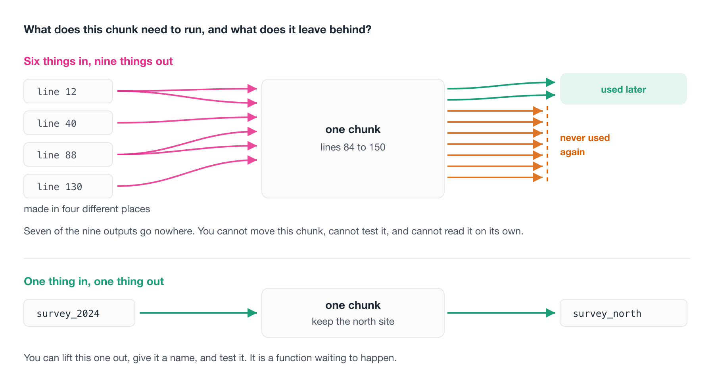

# Writing readable code {#sec-writing-readable-code}

We have focussed on a lot of structural things, that I would class as "easy wins" - where things live, creating projects, file paths and reproducibility, style linting, and project structure - like a README. 

Now let us talk about **how** to read code, to improve it. In an analogy for writing - this is the task of how to become a good editor.

In this section we go over what you are looking for when you read code, and some ideas on code review process.

## Overview {.unnumbered}

- **Duration** 45 minutes
- **Questions**
    - Where does readable code start, once the tools have done their bit?
    - What makes a variable name good enough?
    - How do I break a wall of code into readable pieces?
    - What am I actually looking for when I read code?
    - How do I review code, including my own?

## Good vs bad variable names

There is a quote attributed to [Phil Karlton](https://www.karlton.org/):

> There are only two hard things in computer science: cache invalidation[^:https://yihui.org/en/2018/06/cache-invalidation/] and naming things.

It is comforting to know that naming things is genuinely hard. I think we can sometimes let perfect become the enemy of good - we can combat this by saying:

> **giving things an OK name is much easier than giving things a great name.**

As you practice giving OK names to things, you'll get more practice at naming, and get better. But don't put too much into it.

::: {.callout-caution title="Some history: where the quote comes from" collapse="true"}

Phil Karlton was a principal developer at Xerox PARC, DEC, Silicon Graphics and Netscape. [Martin Fowler has written up the provenance of the quote](https://martinfowler.com/bliki/TwoHardThings.html), which is more interesting than you'd expect. Nobody has ever found where Karlton first said it, and it seems to have travelled by word of mouth from about 1996.

:::

In [Code style and readability -@sec-code-style] we talked about naming *conventions*. Pick one, stick to it, and get tab complete for free.

This is the other half. A name can follow your convention perfectly and still tell you nothing.

```r
library(readr)
library(dplyr)
df1 <- read_csv("survey.csv")
df2 <- df1 |> filter(year == 2024)
df3 <- df2 |> filter(site == "north")
```

That is consistent, it is formatted clean, and a linter has no complaint about it. But if I meet `df3` two hundred lines later I have to go back and reconstruct what it is.

Compare:

```r
survey_raw <- read_csv("survey.csv")
survey_2024 <- survey_raw |> filter(year == 2024)
survey_north <- survey_2024 |> filter(site == "north)
```

Same code, and now the name carries the history of what happened to the data.

The core idea:

> Name the variable separating it by `_`, 

::: {.callout-note title="Your Turn"}

1. Open `07-needs-review/analysis.R` from the messy project repo. Find every object whose name tells you nothing about what it holds.
2. Rename three of them. Don't try to do all of them, and don't aim for perfect names. Aim for OK.
3. Did renaming change how long it took you to work out what the next section does?

:::

## De-chunking code

Here is a phone number:

```
1-8-0-0-1-3-1-0-8-6
```

Ten digits. Try to hold them in your head. Now try this:

```
1800 131 086
```

Same ten digits, and suddenly it's easy.

Nothing about the information changed. Only the **chunking** did.

This is not a party trick. Our working memory holds roughly **seven, plus or minus two** chunks at once, a finding from George Miller's 1956 paper ["The magical number seven, plus or minus two"](https://en.wikipedia.org/wiki/The_Magical_Number_Seven,_Plus_or_Minus_Two). Crucially, memory isn't limited by the amount of information. It's limited by the *number of chunks*.

So make bigger chunks and you hold more.

{fig-alt="Ten pink boxes each holding one digit of 1800131086, labelled 10 chunks, beyond your limit. Below, the same digits in three green boxes reading 1800, 131 and 086, labelled 3 chunks, well within it. Underneath, a box filled with twenty-six anonymous grey lines labelled 50 lines, an arrow pointing right, and a box holding five named green bars: read the data, clean the names, fit the model, build the table, save the figure." width=100%}

Code is the same. The question to keep asking is:

> How do I take all this complexity and break it into smaller pieces, each of which I can reason about, each of which I can hold in my head?

So when you look at a long script:

- **50 lines of code is not 50 ideas.** It is usually four or five ideas, written out longhand.
- **Chunk the code into ideas.** Where does one thing end and the next begin?
- **Reason with them.** Can you say what each chunk does in a sentence?
- **Find the complexity**, and **abstract it**, often into a function with a name that says what the chunk was for.

That last step is what the functions lesson is about. But the chunking comes first, and you can do it with nothing more than a blank line and a comment.

::: {.callout-note title="Your Turn"}

1. In `07-needs-review/analysis.R`, mark where one idea ends and the next begins. A blank line and a comment is enough.
2. How many ideas are in there? Write the number down before you count the lines.
3. Are any two of those chunks doing the same thing to different data?

:::

## What to look for

Once the tools have done their bit, what are you actually reading *for*?

Here are four things worth having names for:

1. Code Smells
2. Inputs & outputs
3. Complexity that has a simpler form
4. Refactoring

### Code smells

A code smell is a bit of code that isn't wrong, but that makes you uneasy.

The word is deliberate, because it is the feeling of opening the fridge and knowing something in there has gone off before you have worked out what.

Smells are useful precisely because they are cheap, and you do not have to prove anything to act on one. You notice that a function is doing three things, or that a block has been copied twice with one number changed, and you make a note.

For a great introduction to this, watch [Jenny Bryan's "Code smells and feels"](https://www.youtube.com/watch?v=7oyiPBjLAWY).

### Inputs and outputs

For any section of code, two questions:

**What does this need in order to run?** and **what does it leave behind?**

If a chunk needs six objects that were made in four different places, that's the finding. You've found something that can't be moved, can't be tested, and can't be understood on its own.

The same goes the other way. A chunk that creates nine objects, seven of which are never used again, is a chunk that hasn't decided what it's for.

Long sections with many inputs and many outputs are the ones worth your attention. They're almost always several ideas wearing one coat.

{fig-alt="Two chunks compared. The first is fed by six pink arrows leaving four boxes labelled line 12, line 40, line 88 and line 130, and emits nine arrows: two green ones reach a box marked used later, and seven orange ones stop dead at a dashed wall marked never used again. The second chunk takes one green arrow in from survey_2024 and sends one green arrow out to survey_north." width=100%}

::: {.callout-note title="Your Turn"}

Open `08-curly-code/penguin-report.R` and find the longest stretch of code between two blank lines.

1. List what it needs in order to run. Where was each of those things made?
2. List what it leaves behind. How many of them are ever used again?
3. Is that one idea, or several wearing one coat?

You do not have to fix anything. Counting the arrows is the exercise.

:::

### Complexity that has a simpler form

Sometimes code is doing something perfectly reasonable in a roundabout way, and R already has the direct version.

```r
sapply(my_list, function(i) length(i))
```

That works, but R already has:

```r
lengths(my_list)
```

Same answer, and now the line says what it means rather than how it is done.

You cannot spot these unless you happen to know the shortcut, which is a bit unfair. So do not go hunting for them. Just notice when a line feels like more machinery than the idea deserves, and have a look.

### Refactoring

**Refactoring** means changing code while keeping its behaviour the same.

It is like giving a car a service, or replacing parts that have worn out. The car still drives the same, it just does so more reliably.

This is the move you make once you have found a smell. The behaviour is fine, and the expression of it is not.

## A process for reviewing code

Here is the process I actually use, and it works on my own code as well as on other people's.

The principle underneath it is this: **let the machine review the mechanics, so that people can review the thinking.**

If a human reviewer spends their attention on spacing, on a misspelled word in a comment, or on `any(is.na(x))`, that attention is gone and it was worth almost nothing. Those are all things a tool does perfectly, instantly, every time.

{fig-alt="Two stacked bands. The upper grey band holds step 1, run the automated checks first, with pills for air format, jarl check, spelling colon colon spell underscore check underscore files, and restart R run from the top; it is labelled done by a machine, in seconds. An arrow crosses the gap saying only then is it worth a person's time. The lower purple band holds steps 2 to 5 - read it top to bottom and edit nothing, chunk it up, expression, and re-expression - labelled only a person can do these." width=100%}

### 1. Run the automated checks first

Before anyone reads it:

- **Format it.** `air format .`
- **Lint it.** `jarl check .` or `lintr::lint_dir()`
- **Spell check it.** `spelling::spell_check_files()`
- **Run it from a clean session.** Restart R, run from the top. If it doesn't run, nothing else matters yet.

Only then is it worth a person's time.

::: {.callout-tip title="Go deeper: if what you are reviewing is a package" collapse="true"}

Everything above works on a folder of scripts. If you are reviewing an R package, there is a tool that checks the habits a package is supposed to have:

```r
goodpractice::gp()
```

It runs `R CMD check`, a set of linters, and a pile of structural checks - whether there is a README, whether the DESCRIPTION is well formed, whether functions are too long or too complex, whether there are tests.

The reason it is down here rather than in the list above is that most of what it checks only exists in a package. Pointed at an analysis project, the great majority of its checks have nothing to look at.

So: excellent tool, wrong shape for the code most of us are reviewing day to day. Worth knowing it exists for the day you write a package.

:::

### 2. Read it top to bottom, and don't edit anything

This one is harder than it sounds, because the urge to fix the first thing you see is strong.

Resist it, because on this pass you are only getting the shape of the thing.

What you are collecting is a list of the places where the code caught you. The bits where it did not quite make sense, or where something was not clear, or where you had to read a line twice.

Those moments are the data, so mark them and keep going.

### 3. Chunk it up

Now put similar things together.

- All `library()` calls at the top, in alphabetical order.
- All function definitions together.
- If a variable is defined at line 10 and isn't used until line 150, move them closer to each other.
- Sections of code that do similar things should sit near each other.
- Add commented section headers so you can see where a new area starts.
- If one of those sections gets long, should it be its own script?

None of this changes what the code does, and all of it changes how much you have to hold in your head to read it.

### 4. Expression: can you follow it?

Now go back to the places that caught you in step 2.

For each one: **do you understand what the code is doing when you read it?**

Not what it does line by line. What it's *for*. If you can't say it in a sentence, that's the finding.

### 5. Re-expression: can you say it more simply?

The last question is the useful one.

**Can you re-express the intention of the code, and keep the output the same?**

That is refactoring, and it is where the smells you noticed earlier get cashed in. The copied block becomes a function, the nine objects become one, and the `sapply` becomes `lengths`.

Then you run it again and check that the output did not move.

::: {.callout-tip title="Some questions worth asking as you go" collapse="true"}

**Can I tell what this is for?** If you cannot say it in a sentence, that is the finding.

**Is the running order obvious?** Could a stranger tell what to run first?

**Are the names consistent, and do they mean anything?** `get.data()` versus `getData()` versus `get_data()` in one project is a real cost, paid every time someone has to remember which.

**Can I reason about each piece separately?** Or do I have to hold the whole thing in my head at once? This is the chunking question from earlier, asked about someone else's code.

**What would break if the data changed slightly?** Extra column, a new `NA`, a factor level nobody expected.

**Is anything here that I could regenerate?** Or, conversely, is anything precious sitting somewhere disposable?

:::

::: {.callout-note title="Your Turn"}

1. Run steps 1 to 3 on `07-needs-review/analysis.R`. Actually run `air` and the linter. Don't just read them.
2. The code still isn't easy to follow. Write down three places where it caught you.
3. Pick one and do step 5. Re-express it, then check the output hasn't changed.

:::

## Reviewing someone else's code

Everything above works on your own code. Doing it to someone else's is a different skill, and most of the difference is social rather than technical.

1. Start by asking what they want
2. Non-adversarial
3. Run the code, don't just read it
4. It will be slow, at first
5. 

### Start by asking what they want

The most useful question you can ask before reading a single line is: **what kind of feedback are you looking for?**

Someone who wants to know whether the statistics are right does not want thirty comments about variable names.

And the second question: **what is this code meant to do?**

Find the intention before you review the implementation. Half of what looks like a mistake turns out to be a decision you didn't have the context for.

### Non-adversarial, on purpose

Review is not a verdict. The goal is better code, not a judgement about whether the code passed.

That sounds obvious written down, and it is surprisingly easy to lose once you are twenty comments deep.

Two things that keep it on track.

**Review the code, not the person.** "This function is doing three things" is useful. "You always overcomplicate things" isn't.

**Say what's good, specifically.** This is not politeness. If you only ever name problems, people learn what to avoid but never what to aim for.

### Exercise the code, don't just read it

Don't review from reading alone. Run it.

Then run it on something slightly different from what the author ran it on. Your data, an extra column, a year that isn't in their file.

Reading tells you whether code is comprehensible. Running it on something unfamiliar is what surfaces the assumptions the author didn't know they were making.

::: {.callout-tip title="When it breaks and you cannot see why"}

Cut it down. Take the failing thing and remove everything that is not needed to make it fail, one piece at a time, until what is left is small enough to see through.

That is a review technique, and it is also exactly how you make a **reprex** - a small self-contained example someone else can run. We come back to it properly later in the course. For now the useful habit is the same either way: make it smaller until it is obvious.

:::

### It will be slow at first

Your first few reviews will take ages, and you will finish them feeling like you did not have much to say.

That is normal, and it is what reviewing is like at the start.

Reviewing is a skill like any other, and it gets faster with practice. The people who seem to spot things instantly have simply read a lot of code.

::: {.callout-tip title="If you want to see this done at full scale"}

Open software peer review is the most developed version of this practice, and it is all public. [rOpenSci's reviewer guide](https://devguide.ropensci.org/softwarereview_reviewer.html) sets out what a reviewer is asked to look at, and their [review template](https://devguide.ropensci.org/reviewtemplate.html) is the checklist itself. Reviews happen in the open on GitHub and are signed, so you can read hundreds of real ones.

Two things there are worth stealing even for a small analysis project: reviews are explicitly **non-adversarial**, because the goal is better software rather than a verdict. And reviewers are asked to comment on things a checklist can't capture, such as whether the argument names read well and autocomplete sensibly.

That last one should sound familiar from the naming lesson.

:::

::: {.callout-note title="Your Turn"}

1. Pair up. Swap the version of `analysis.R` you tidied earlier.
2. Before you read it, ask your partner the two questions: what feedback do they want, and what is the code meant to do?
3. Give three pieces of feedback. At least one of them should be something that's working well.

:::

::: {.callout-tip title="If you want a longer one" collapse="true"}

`08-curly-code/penguin-report.R` in the exercises repo is the same idea at greater length. It runs, it produces a report, and a linter finds 55 things in it across 23 rules before you get to anything a person has to see.

Work the five steps on it end to end. The automated pass takes about a second, and everything interesting happens after that.

:::

## Clean as you go

Get into the habit of going back over your code briefly to tidy it up, as you go.

A kitchen analogy is useful here. Professional kitchens clean as they go, because a tidy workspace keeps your mind clear and because the alternative is an unusable bench by service. The same is true of code.

I rarely write my best code on the first pass. It gets better with iteration.

So iterate briefly, as you go:

- Clean up the random comments that no longer mean anything.
- Remove the wilted lettuce. These are the commented-out chunks of code you *might just come back to*. You probably won't. If one really is important, write a comment explaining why it might be relevant, rather than leaving it lying there.
- Fix the style.
- Check the names.
- Consider tidying up the implementation, refactoring it.

You might not have time to do all of these, or to do them thoroughly. Doing *some* of them will still leave you with better code, and you get better at doing them the more you practise.

::: {.callout-tip title="If we can see your code, we can trust it"}

Version control isn't part of this course. It has its own.

But it's worth saying plainly that the single biggest improvement to reviewability is putting your code somewhere it can be seen, with a history.

Review is much easier when the reviewer can see not just what the code is, but how it got that way.

:::

::: {.callout-note title="Your Turn"}

1. Open a script of your own. One you wrote at least a month ago.
2. Give it ten minutes of clean-as-you-go. Comments, wilted lettuce, style, names.
3. Ten minutes only. What did you get done, and what would you do next?

:::

::: {.callout-tip title="Read more"}

Parts of this chapter are adapted from my blog post, [How to get good with R](https://www.njtierney.com/posts/2023-10-30-how-to-get-good-with-r/).

:::
